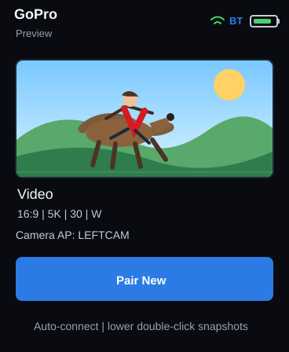
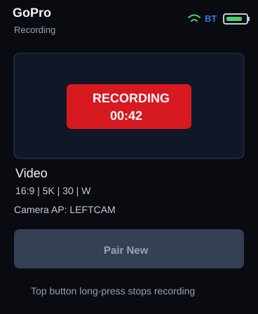
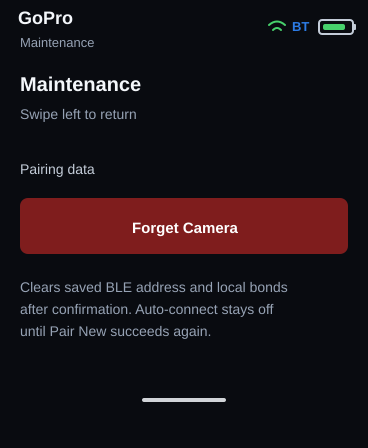

# ESP32-S3 1.8-inch AMOLED Open GoPro Remote

| Preview | Recording | Maintenance |
| --- | --- | --- |
|  |  |  |

PlatformIO firmware for a GoPro remote that uses the current Open GoPro BLE and Wi-Fi control flow.

The current hardware path is the ESP32-S3 remote with the integrated 1.8-inch AMOLED screen:

- `esp32s3_amoled_ui`: ESP32-S3 1.8-inch AMOLED display/touch remote UI with BLE pairing, GoPro Wi-Fi connection, physical-button controls, battery/status indicators, and JPEG snapshot preview.
- `esp32dev`, `esp32s3_radio`, and `ui_esp32dev_sim`: legacy radio/simulator targets kept for diagnostics and protocol experiments.

## What It Does

- Scans for BLE devices advertising GoPro/Open GoPro service names, including `GoPro`, `MISSION`, and `GP`.
- Saves the paired camera BLE address, advertised BLE name, and GoPro AP SSID in NVS. Reconnect prefers the exact saved BLE address, but can use the saved BLE name as a fallback if a newer GoPro advertises with a changed address.
- Connects over BLE and reads the camera Wi-Fi AP SSID/password from Open GoPro characteristics.
- Sends the BLE Wi-Fi enable command `03:17:01:01`.
- Joins the camera AP for HTTP camera control.
- On the AMOLED UI target, the lower/action side button double-click syncs the current Video preset settings, takes one temporary photo snapshot, downloads/displays the larger JPEG screennail preview fullscreen through the current video framing crop, restores Video mode, and deletes the captured JPEG from the camera.
- The top-right side button starts video recording; while recording, a long press stops recording and the preview area shows a local elapsed-time `RECORDING` overlay without polling the camera.
- After reconnect, `/gopro/camera/state` restores the remote's recording overlay from the camera Encoding flag and Video Encoding Duration.
- Connects to the GoPro camera Wi-Fi AP using credentials read over BLE.

## AMOLED UI Button Behavior

This applies to the `esp32s3_amoled_ui` firmware. The top status banner stays visible when the display is on.

| App / screen state | Top-right side button | Lower/action side button |
| --- | --- | --- |
| Normal preview screen | Start video recording | Single click blanks the display; double click takes one snapshot, downloads its JPEG preview, deletes the JPEG from the GoPro, then shows the preview fullscreen; long press enters low-power shutdown |
| Fullscreen snapshot preview | Start recording and return to the normal preview layout | Single click returns to the normal preview layout; the next single click blanks the display |
| Recording | Long press stops recording; short press only shows a hold-to-stop reminder | Single click blanks/wakes the display; double click is ignored because snapshots and Pair New are disabled while recording; long press enters low-power shutdown |
| Pair New popup / pairing scan | No recording action | Cancel Pair New and reconnect the previously saved camera |
| Display sleeping | Start recording when idle; long press stops if already recording | Single click wakes the display |
| Maintenance screen | Same as current recording state | Single click returns to the normal preview screen; long press enters low-power shutdown |

Swipe right from the normal preview screen to open the maintenance screen, including while the remote is trying to connect over BLE or Wi-Fi. The maintenance screen follows the finger while swiping and snaps open/closed at release. Swipe left or single-click the lower/action side button from maintenance to return. When the GoPro Wi-Fi connection is active, the home screen shows a passive `Camera Connected` strip instead of a pairing action. If a saved-camera scan fails, the same home strip changes to `Scan Again` so you can retry without forgetting or replacing the saved camera. Use maintenance for camera replacement and recovery: `Forget Camera` requires confirmation, cancels any current BLE/Wi-Fi connection attempt, clears the saved BLE address and local bond information, and disables boot auto-connect until Pair New succeeds again.

## AMOLED Serial UI Test Commands

The `esp32s3_amoled_ui` target accepts USB serial commands at `115200` for repeatable UI testing:

- `help` - print the command list.
- `status` - print display, recording, BLE, Wi-Fi, pairing, and saved-camera state.
- `touch X Y [hold_ms]` - inject a touch at a screen pixel through the LVGL input driver.
- `swipe X1 Y1 X2 Y2 [duration_ms]` - inject a pixel-level swipe through the LVGL input driver.
- `lower [single|double]` - simulate the lower/action side button. `lower double` runs the snapshot path.
- `top [short|long]` - simulate the top-right side button. `top long` stops recording when already recording.
- `pair`, `connect`, `rescan`, `snapshot`, `record`, and `cancel` - run the same firmware actions used by the UI/buttons. `rescan` is an alias for retrying the saved-camera connection.
- `page home|maintenance`, `fullscreen on|off`, `forget show|confirm|cancel`, and `display on|off` - force specific UI states for testing.

`lower shutdown` intentionally exercises the low-power shutdown path. `lower long` is ignored over serial so an accidental command does not power the device down.

## Build Targets

- `esp32dev`: radio firmware for the currently attached ESP32 dev board.
- `esp32s3_radio`: radio firmware for an ESP32-S3 dev board.
- `esp32s3_amoled_ui`: primary touch UI firmware for the ESP32-S3 1.8-inch AMOLED board.
- `ui_esp32dev_sim`: UI-host simulator build. It uses serial text as the display/touch stand-in and talks to the radio firmware over `Serial2`.

The top-level `Makefile` wraps the normal PlatformIO commands:

```sh
make build           # build esp32s3_amoled_ui
make upload          # auto-detect and flash the ESP32-S3 serial port
make monitor         # auto-detect and open serial monitor
make upload-monitor  # flash, then monitor
make status          # send firmware serial status command
make snapshot        # run snapshot path over serial
make lower-double    # simulate lower side-button double click
```

`make ports` lists visible serial devices and prints the preferred ESP32 port. Override auto-detection with `PORT=/dev/ttyACM0` if needed, and override the selected PlatformIO environment with `ENV=...`. `make build-all` builds the active firmware matrix.

Build one environment:

```sh
pio run -e esp32s3_radio
pio run -e esp32s3_amoled_ui
pio run -e ui_esp32dev_sim
```

## S3 1.8-inch AMOLED Architecture

The S3 1.8-inch AMOLED board owns the LCD, touch, buttons, battery UI, GoPro menu, BLE pairing, GoPro Wi-Fi, HTTP camera control, and JPEG snapshot preview display.

```text
GoPro <-- BLE/Wi-Fi --> ESP32-S3 UI/radio/display
```

The S3 1.8-inch AMOLED target owns:

- LCD output
- Touch input
- Side buttons and power behavior
- UI/menu rendering
- BLE pairing/wake
- Normal GoPro HTTP controls
- JPEG snapshot preview display

## Legacy Radio Serial Commands

Open the serial monitor at `115200` on the non-AMOLED radio targets.

- `help` - show commands
- `status` - print current BLE/Wi-Fi/stream state
- `scan` - scan for GoPro BLE advertisements
- `connect` - connect to the first matching BLE camera
- `pair` - finish BLE pairing while the camera is in Bluetooth pairing mode
- `wake` - BLE connect, read camera AP credentials, enable camera Wi-Fi
- `goproap` - join the camera AP read over BLE
- `cameraap LEFTCAM password` - manually set camera AP credentials for renamed cameras such as `LEFTCAM`, `RIGHTCAM`, or `MIDCAM`
- `localwifi` - join the configured home/infrastructure Wi-Fi
- `ip 10.5.5.9` - set the camera HTTP IP
- `stream` - start GoPro preview stream and listen on UDP/8554
- `stop` - stop preview stream
- `shutter on` / `shutter off` - start or stop recording over HTTP
- `proxy 192.168.1.50 8554` - forward received preview UDP packets to another machine
- `autostart` - run `wake`, `goproap`, and `stream`

## UI Host Simulator

The UI simulator presents a text menu over USB serial and sends framed commands to the radio over `Serial2`.

Controls:

- `u` / `d` - move selection
- `s` - select
- `pair`, `wake`, `stream`, `stop`, `state`, `presets`
- `cameraap LEFTCAM password`
- `ip 10.5.5.9`
- `preset ID`
- `raw /gopro/camera/state`

The simulator receives:

- ACK / error / log messages
- radio status JSON
- camera JSON responses
- preview stream packet chunks and byte counters

## AMOLED LCD / Touch Hardware

The active UI target is the ESP32-S3 Touch AMOLED 1.8 board. The firmware uses the board's QSPI AMOLED display, FT3168 touch controller, AXP2101 PMU, and side buttons through the board support libraries referenced by `platformio.ini`.

The preview is intentionally JPEG snapshot based. The remote does not decode the GoPro H.264 live stream on the S3; the lower/action button captures one still image, displays it through the active Video preset's aspect/framing plus an estimated HyperSmooth crop, restores Video mode, and deletes the captured JPEG from the GoPro. GoPro does not expose a precise dynamic stabilization crop rectangle through the public Open GoPro HTTP state, so the remote uses the active preset settings to approximate the frame that recording will use.

## Radio Firmware Physical Controls

The non-AMOLED radio firmware can use the ESP32 `BOOT` button for diagnostics. The ESP32 `EN` button is reset-only, so firmware cannot read a long press on it. The built-in `BOOT` button is usually GPIO0 and is used as the default remote button after the board has booted.

- Short BOOT press: start/stop preview stream
- About 1 second BOOT press: wake camera, join camera AP, start stream
- About 3 seconds BOOT press: finish BLE pairing

To pair, put the GoPro into its Bluetooth pairing screen, then hold BOOT for about 3 seconds or send `pair` over serial. Do not hold BOOT while resetting/powering the ESP32, because GPIO0 held low at reset enters the ESP32 bootloader.

## Notes

`GOPRO_AUTO_CONNECT_ON_BOOT=1` is enabled for the AMOLED UI target. Auto-connect only runs when a saved BLE camera binding exists. After `Forget Camera`, boot auto-connect is skipped until `Pair New` completes successfully.

GoPro MISSION 1 was announced in April 2026. GoPro's public Open GoPro compatibility page had not yet listed Mission 1 when this firmware was created, so this targets the current Open GoPro BLE/Wi-Fi contract used by newer supported GoPros and scans for `MISSION` names as well.
