# GoPro Remote User Manual

This manual covers the current single-device ESP32-S3 AMOLED remote firmware.

The remote uses Bluetooth Low Energy first. After pairing, it reads the GoPro camera Wi-Fi SSID and password over BLE, enables the camera Wi-Fi AP, then connects the ESP32-S3 to that GoPro AP for HTTP camera control and manual JPEG snapshots.

The screenshots below are generated UI reference images based on the current LVGL screen layout and app states. They are not photos from the physical AMOLED panel.

## Hardware

- ESP32-S3 Touch AMOLED 1.8 board
- GoPro with Open GoPro BLE/Wi-Fi support
- USB cable for flashing/debugging
- Battery connected to the board PMU for portable use

## Flashing The Remote

From the project root:

```sh
pio run -e esp32s3_amoled_ui -t upload --upload-port /dev/ttyACM0
```

Open a serial monitor if you want boot diagnostics:

```sh
pio device monitor -e esp32s3_amoled_ui
```

Normal boot output ends with:

```text
GoPro AMOLED UI boot
AXP2101 PMU initialized
AMOLED UI ready
```

## Screen Reference

The default screen is the capture/preview screen, matching the basic GoPro rear-screen flow. Swipe right from the preview screen to open Maintenance, and swipe left from Maintenance to return. The battery and Wi-Fi cluster stays visible at the top.

### Capture Screen

The capture screen is the home screen. It shows the JPEG preview area, current mode, format overlay, camera connection state, Wi-Fi state, and a full-width `Pair New` button. Camera Wi-Fi connection runs automatically after boot.

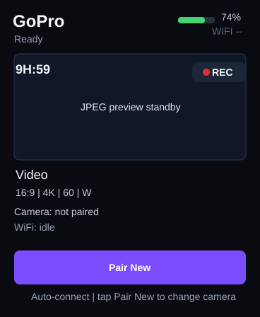

Top-right indicators:

- Battery icon: read from the AXP2101 PMU.
- Wi-Fi icon: gray while disconnected/connecting, green when connected to the GoPro AP.
- Bluetooth icon: blue while BLE is connected.

## Touch Controls

- `Pair New`: tap to pair a different GoPro while that GoPro is in pairing mode. This button is disabled while recording.

Reference pages compiled into the UI:

- Capture: preview, record state, mode, aspect, resolution, FPS, lens, camera connection, and snapshot/record button behavior.
- Modes: Video, Photo, and TimeWarp mode cards.
- Capture Settings: aspect ratio, resolution, frame rate, digital lens, HyperSmooth, scheduled capture, duration, and HindSight.
- Pro Controls: bit depth, bit rate, Max Lens, media format, photo output, anti-flicker, performance, control mode, video mode, and profiles.
- Dashboard: connect camera, pair BLE, camera state, system settings, and physical button reference.

### Modes Screen

The Modes page switches the active capture mode between Video, Photo, and TimeWarp. The selected mode updates the capture overlay on the home screen. Horizontal swipe navigation to this page is disabled on the current AMOLED build.

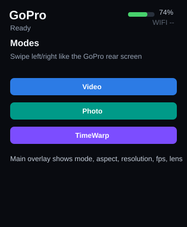

### Capture Settings Screen

The Capture Settings page exposes the common GoPro capture options. Tapping a setting opens the dynamic option sheet for that setting.

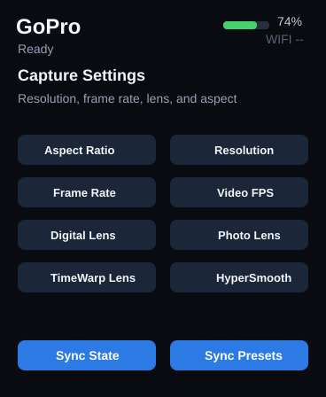

### Pro Controls Screen

The Pro Controls page exposes advanced Open GoPro settings that are separate from the basic capture controls.

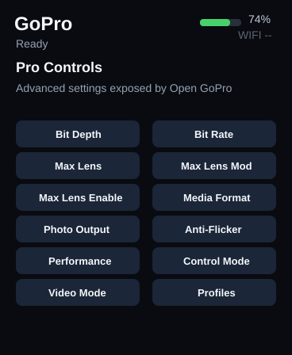

### Dashboard Screen

The Dashboard page contains connection actions, BLE pairing, camera state sync, system settings, and the physical button mapping.

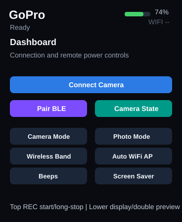

### Setting Sheet

The setting sheet appears over the current page after tapping a setting. It shows the current value, camera-reported available options, pagination, and a close control. Options are queried from the camera before the sheet is populated.

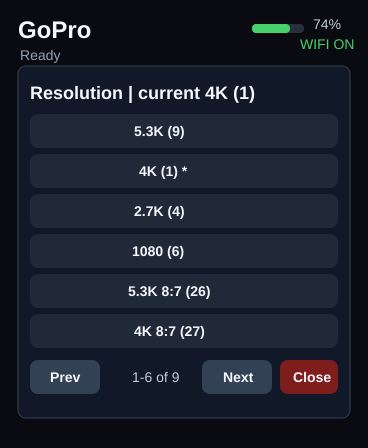

## Side Buttons

The board has two side buttons:

- Top-right side button short press: start recording.
- Top-right side button long press while recording: stop recording.
- Lower side button single click: blank/wake the display, or exit fullscreen preview.
- Lower side button double click: take one JPEG snapshot, download/display it fullscreen, then delete it from the GoPro.
- Lower side button long press: enter low-power shutdown through the AXP2101 PMU.
- Lower side button during `Pair New`: cancel the active pairing attempt without replacing the saved camera binding.

Use the on-screen `Pair New` button for pairing.

## Pairing A GoPro

1. On the GoPro, open the Bluetooth pairing screen.
2. On the remote, tap `Pair New` on the capture screen.
3. The remote scans for GoPro BLE devices and sends the Open GoPro pairing finish command.
4. The previous saved camera binding is kept until the new pairing command succeeds.
5. Press the lower side button during pairing to cancel without changing the saved camera.
6. After pairing, reboot or wait for the automatic connection flow to connect to the GoPro camera AP.

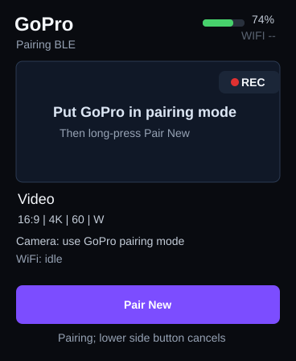

During BLE scanning, the remote searches for nearby devices matching GoPro/Open GoPro service names, including `GoPro`, `MISSION`, and `GP`.

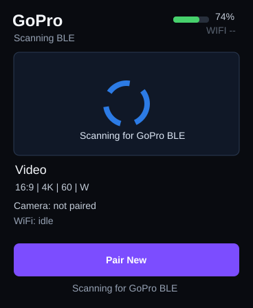

After the BLE connection succeeds, the remote reads the GoPro AP SSID and password from the camera over BLE.

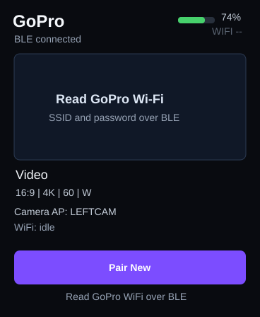

## Connecting To GoPro Wi-Fi

The remote does the full Wi-Fi setup automatically:

1. Connects to the GoPro over BLE.
2. Reads the GoPro AP SSID and password from BLE.
3. Enables the GoPro Wi-Fi AP over BLE.
4. Connects ESP32-S3 Wi-Fi to the GoPro AP.
5. Uses `http://10.5.5.9:8080` for GoPro HTTP commands and JPEG preview.

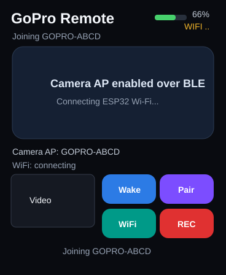

When connected, the top-right Wi-Fi indicator turns green and the `WiFi:` line shows the ESP32 address on the GoPro AP.

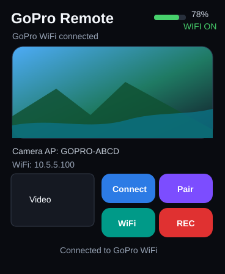

## GoPro-Style Settings

The UI is organized after the GoPro rear screen:

- Default capture page first.
- Horizontal page swipe is disabled on the AMOLED build.
- Capture overlay shows mode and the camera-reported capture format.
- Capture settings and Pro Controls are separate pages.
- Dashboard-style connection and physical-button controls live on their own page.

The settings list is based on the Open GoPro setting groups available over BLE/Wi-Fi. Because legal options vary by camera model, firmware, current preset, and whether the camera is recording, the firmware queries the camera before showing options. Tapping a setting opens an option sheet. The remote queries the current value, asks the camera for currently available options, shows those options, and sends `/gopro/camera/setting?setting=<id>&option=<option>` when you choose one.

`Sync State` refreshes the current values from `/gopro/camera/state`. `Sync Presets` refreshes the current preset tree from `/gopro/camera/presets/get?include-hidden=1`.

See [gopro_ui_research.md](gopro_ui_research.md).

## JPEG Preview

The preview area is a manual JPEG snapshot path, not full real-time video decode.

Current behavior:

- Double-click the lower side button while not recording to take one GoPro photo, download its JPEG preview, display it fullscreen, and delete the captured JPEG from the camera.
- Swipe up or single-click the lower side button while the snapshot is fullscreen to return to the normal capture page.
- While recording, snapshots are disabled.

Common preview messages:

- `Double-click lower for snapshot`
- `No GoPro JPEG media found`
- `JPEG fetch failed`
- `JPEG decode failed`

## Recording

Short-press the top-right side button.

When recording starts:

- The remote sends `/gopro/camera/shutter/start`.
- Status changes to `Recording`.
- The preview area shows a red `RECORDING` overlay and locally timed elapsed duration.
- The remote does not poll the camera for the timer while recording.

Long-press the top-right side button to stop recording. The remote sends `/gopro/camera/shutter/stop`.

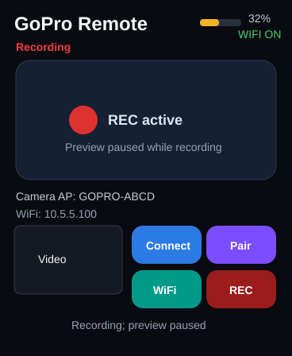

## Display Sleep And Power Off

Single-click the lower side button to blank or wake the display. This saves display power but does not fully shut down the ESP32-S3. Double-click the lower side button takes one snapshot when the camera is not recording.

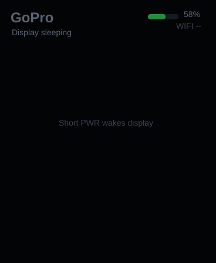

Long-press the lower side button to enter low-power shutdown:

- Recording state is cleared locally.
- Wi-Fi is disconnected and turned off.
- The AMOLED is dimmed.
- The firmware asks the AXP2101 PMU to shut down.
- If PMU shutdown is unavailable, the ESP32-S3 enters deep sleep as a fallback.

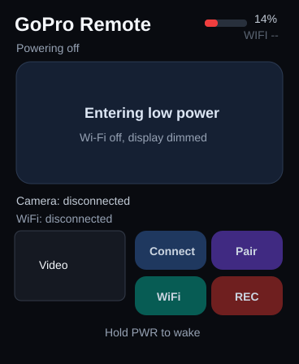

On USB power, the board may not appear fully off because USB continues to supply power. Test battery drain while running from battery.

## Normal Use Checklist

1. Power on the ESP32-S3 remote.
2. Confirm the main screen appears.
3. Put the GoPro into pairing mode if this is the first connection.
4. Tap `Pair New`.
5. Wait for the automatic camera Wi-Fi connection.
6. Double-click the lower side button for a snapshot preview.
7. Press the top-right side button to start recording; long-press it to stop recording.
8. Single-click the lower side button to blank the screen between uses.
9. Long-press the lower side button for low-power shutdown.

## Troubleshooting

`Camera: BLE not found`

The GoPro is not advertising nearby, is already connected to another controller, or is not in the expected pairing/advertising state. Wake the GoPro and put it back into pairing mode if needed.

`GoPro WiFi credentials unreadable`

BLE connected, but the Wi-Fi service or characteristics were not readable. Re-pair the camera from the GoPro pairing screen.

`GoPro WiFi connect failed`

The remote read credentials but could not join the camera AP. The camera AP can take a moment to become visible after the BLE enable command. Reboot the remote to retry the automatic connection flow.

`Double-click lower for snapshot`

The remote has not joined the GoPro AP yet. Wait for automatic connection or reboot the remote to retry.

## Build Verification

The current codebase has been built for:

- `esp32dev`
- `esp32s3_radio`
- `esp32s3_amoled_ui`
- `ui_esp32dev_sim`
- `esp32p4_ui` optional P4 worker shell
- `dfrobot_p4_decode_probe`

Run the same build matrix:

```sh
pio run -e esp32dev -e esp32s3_radio -e esp32s3_amoled_ui -e ui_esp32dev_sim -e esp32p4_ui -e dfrobot_p4_decode_probe
```
