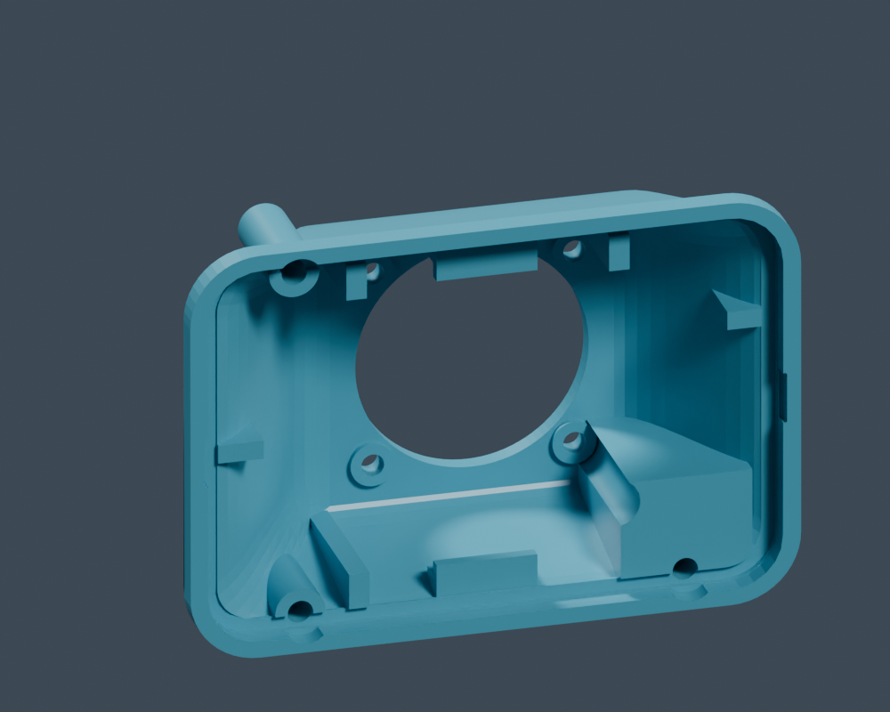
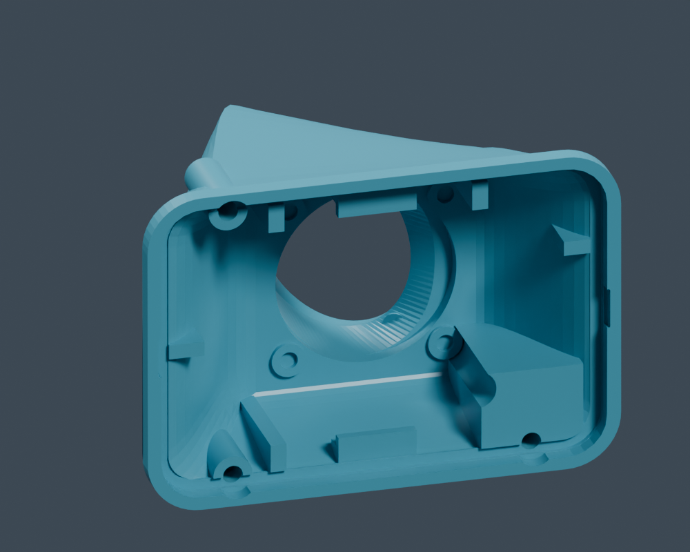
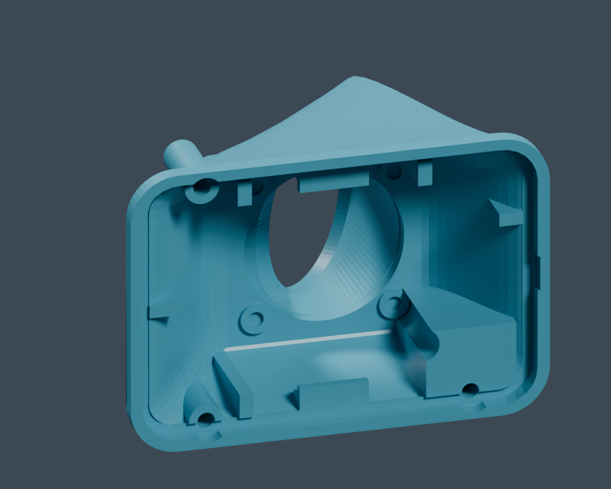
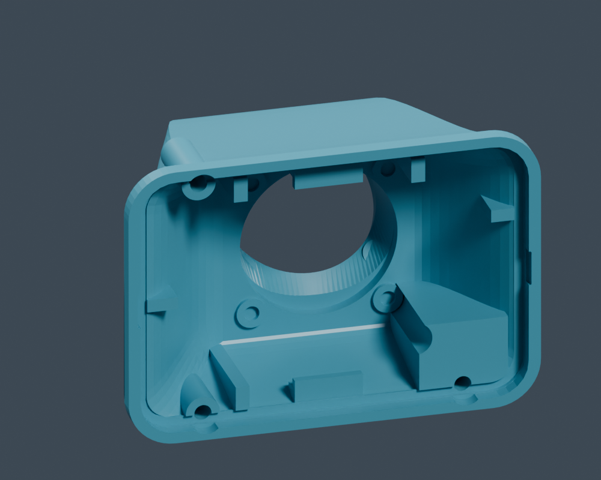
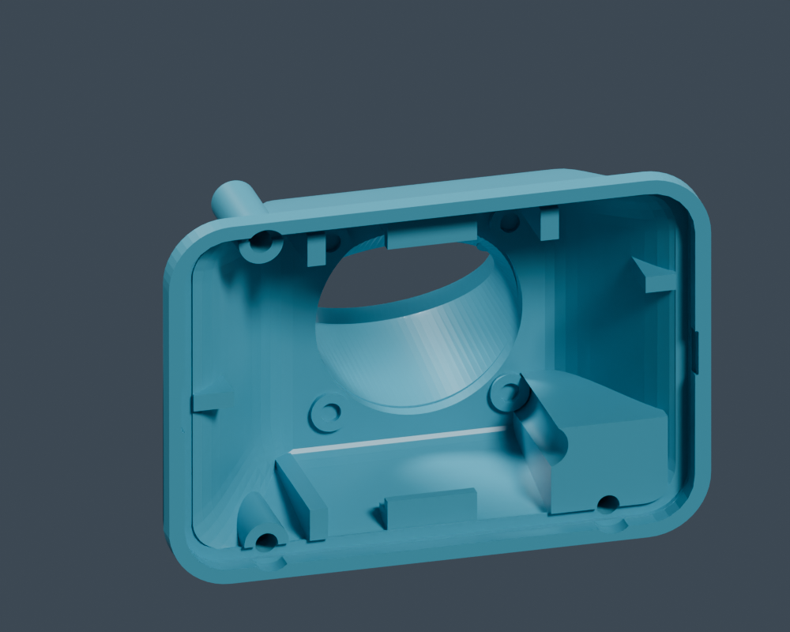
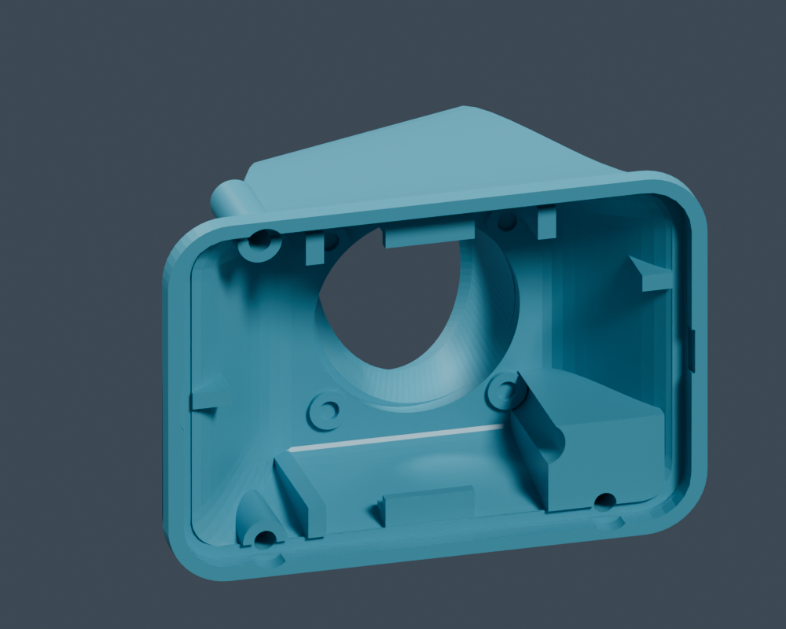
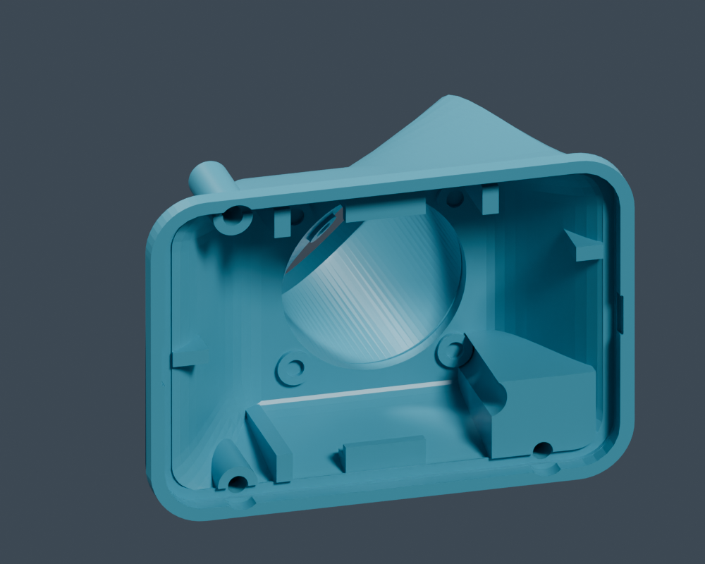

The rear fan mount supports independent horizontal and vertical angles from
−45° to +45°. Both default to 0°, which produces the original shell geometry.

```bash
blender --python gopro_fan_case_parametric_blender.py -- \
  --fan-angle-horizontal 30 --fan-angle-vertical -20
```

In Blender's Text Editor, edit `FAN_ANGLE_HORIZONTAL_DEG` and
`FAN_ANGLE_VERTICAL_DEG` in the script's CONFIG section. Command-line values
override those settings; Blender options go before `--` and script options
after it. Run with `-- --help` to see the angle arguments.

| Setting | Positive direction | Negative direction |
| --- | --- | --- |
| `--fan-angle-horizontal` | +X, right when looking at the rear | −X, left |
| `--fan-angle-vertical` | +Z, up | −Z, down |

The outward fan axis starts along −Y. Each angle is measured in its respective
X/Y or Z/Y projection: its direction is
`normalize((tan(horizontal), -1, tan(vertical)))`. Combining +45° on both axes
therefore produces a 54.74° total tilt. There is no extra roll.

The dome transitions into a rigid, flat mounting pad perpendicular to this
axis. Its opening, circular screw pilots, and screw bosses follow the pad.
The optional rear fan adapter rotates with it in the assembled scene; its
separate STL remains in the original flange-down print orientation. Fan-size
and offset settings remain in the adapter's local frame.

For angled mounts, install the adapter **from the fan side before fitting the
fan**. Its four 4.3 mm source clearance bores accept screws that thread into the
case's 3.6 mm blind pilots. Sealed sleeves through the horn provide 8.6 mm
head/driver clearance, suitable for heads up to 8 mm. With the default 4 mm
adapter flange and 4 mm case engagement, use at most 7.5 mm under-head screw
length to retain 0.5 mm bottom clearance. Measure the selected hardware.
`REAR_FAN_ADAPTER_SCREW_ACCESS_DIAMETER` adjusts head clearance. Source captive
nuts are unsupported at nonzero angles, and the script rejects fan-size/offset
combinations whose head-access sleeves overlap the target mounting hardware.
The 0° adapter retains its original fastening arrangement.

Angled settings add rearward depth and material. The inner cartridge sealing
surface, cartridge parts, camera stops, sleeve joint, and perimeter screw seats
retain their original positions. The original solid dome forms the minimum
wall envelope around the tilted dome, preventing the fixed cavity from
breaking through at steep angles. A bent circular passage connects the tilted
opening to the cartridge inlet, and the perimeter screw-access cuts extend
through the deeper dome. Nonzero angles require `BACK_DOME_ENABLED = True`.

These are geometry and assembly checks; the angled variants have not yet been
physically printed or tested for airflow.

The following previews use the default TPU back. Inside views hide the
removable cartridge and sleeve to expose the fixed interior and the changing
airflow passage. All seven options build and validate the complete assembly.

| Horizontal / vertical | Outside | Inside |
| --- | --- | --- |
| 0° / 0° |  |  |
| −45° / 0° |  |  |
| +45° / 0° |  |  |
| 0° / −45° |  |  |
| 0° / +45° |  |  |
| +30° / −20° |  |  |
| +45° / +45° |  |  |

The default 60 mm adapter mounted at +30° horizontal and −20° vertical:


From the repository root, run the regression checks and regenerate the images:

```bash
blender --background --factory-startup --threads 8 --python-exit-code 1 \
  --python models3d/fan-case/check_fan_angles.py
blender --background --factory-startup --threads 8 --python-exit-code 1 \
  --python models3d/fan-case/render_fan_angle_previews.py
```

The checks cover CLI bounds and invalid values, small and maximum angles on
both axes, all four compound limits, pad normals and pilot walls, perimeter
screw access, preserved material at more than 21,000 cavity-wall locations,
complete TPU/rigid assemblies, cartridge clearance and retention,
adapter clearance, the full screw-head/driver installation path and sealed
access sleeves, and flange-down STL export and print-bed layout.
