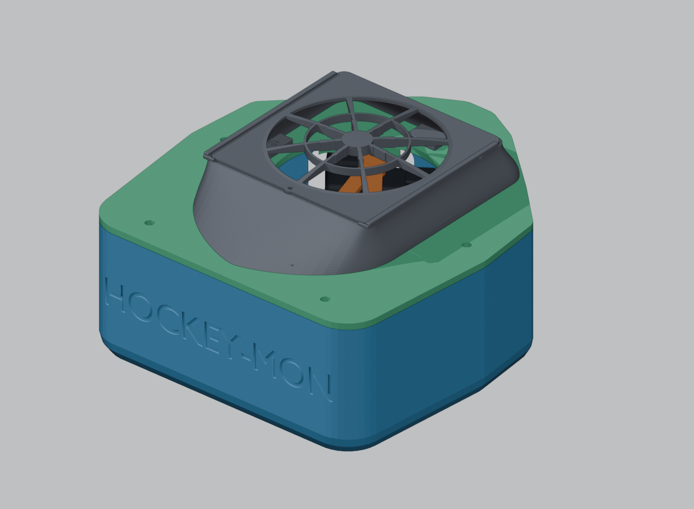
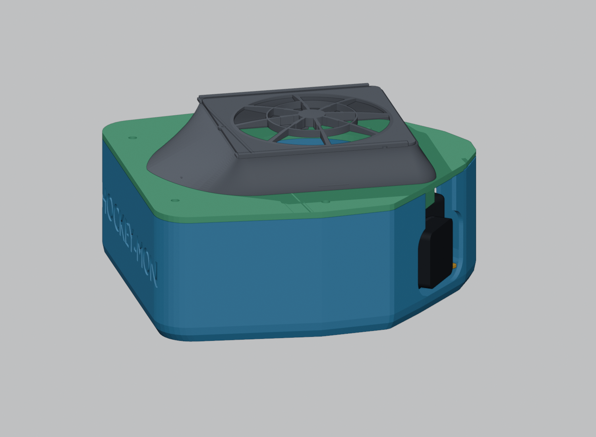
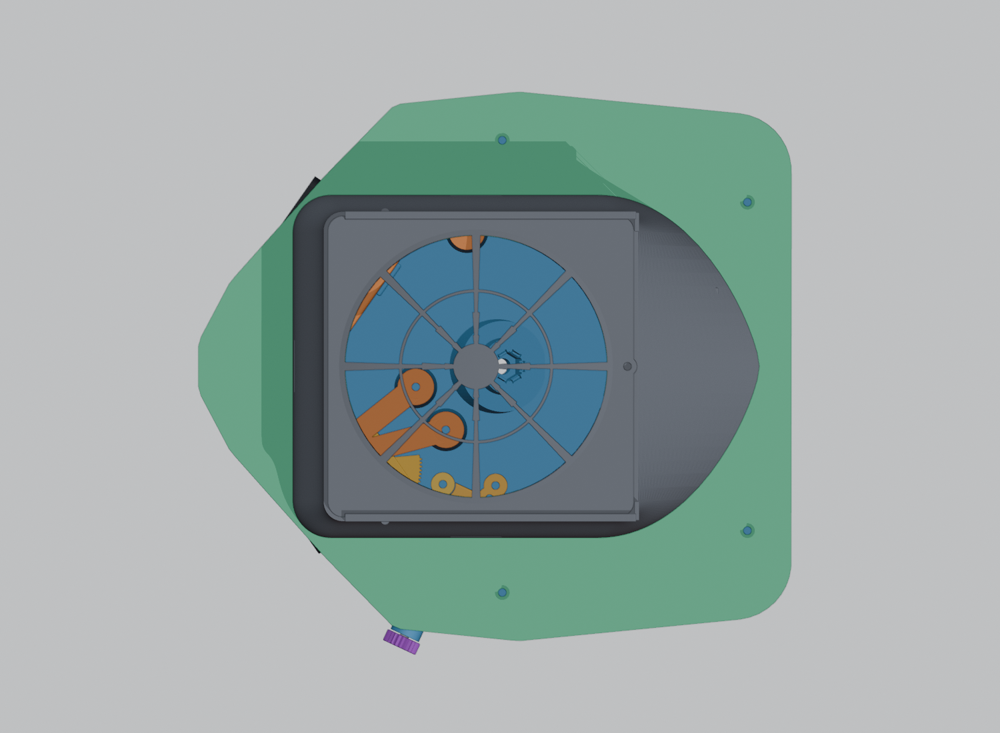
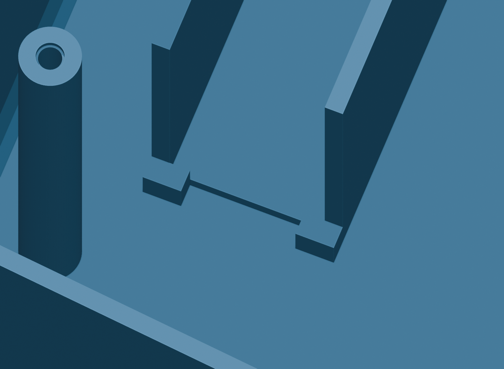

# HockeyMON camera case

Build from the repository root:

```sh
make -C models3d hockeymon-camera-case
make -C models3d dim-pdf
make -C models3d check-dim-pdf-sync
make -C models3d check-hockeymon-battery-slot
make -C models3d check-hockeymon-fan-cover
```

## Streamlined fan cover and rear corners







The fan fairing now sweeps **52 mm aft** into a low, rounded tip above the
battery bay. Its broad shoulders blend into the existing fan grille, which
still slides forward after removing its top locking screw. The fan mounting
positions and two hidden fairing screws stay in place. The hollow tail uses
a surface-normal wall offset so its shallow roof retains the selected wall
thickness. Print the fairing open side down with removable supports beneath
the tail; the separate grille still prints flat without supports.

Rear case corners use a **24 mm radius**, with the outer envelope margin
controlled separately so rounding does not grow the case beyond the printer
limit. The 40 mm USB space, rear screw access and battery fit are checked
against the rounded shell. Use the matching base and lid for this revision.

## Internal rear battery bay


The **26.3 × 70 × 138 mm** battery goes **inside the case**, upright:
26.3 mm along X (front to back), 138 mm along Y (across the back), and
70 mm vertically. Its USB-A/USB-C face points toward **+Y**, into a
**40 mm internal clearance zone** for plugs and cable bends. The plug region extends over the face above the low corner stops, with an
open path through the center below them.

The base and matching main lid extend rearward, with a taller roof to keep
the footprint within a **250 × 250 mm print bed**. The default base measures
**249.25 × 231.11 × 90 mm**. Main body height is 94.653 mm; the external fan
and grille sit above it. Camera positions and the worm-shaft exit remain
unchanged. Rear lid screws move behind the battery and stay accessible.
Use the matching base and lid from this revision. The largest part has only
0.75 mm total spare width on a 250 mm bed, so slice it without an outward
brim or skirt. Each part exports separately in its intended print orientation;
the generator rejects any export wider or deeper than 250 mm.



Two thick tabs at the USB end oppose the cradle's closed end wall, limiting
battery movement in both directions along its length. Each projects **3 mm**
across a bottom corner, rises **4 mm above the seat**, and is **4 mm thick**
along the end. The lowest 4 mm at those two corners must be free of ports.
The center of the USB face and the space above the tabs remain open, with
40 mm for plugs and cable bends. The top retaining bar still holds the pack
down; remove it before lifting the battery past the stops.

The U-shaped cradle has **0.6 mm clearance per side**, giving a **27.5 mm
clear width** and **139.2 mm length** to the open USB end. Its 3.2 mm walls
rise to Z=60 mm. The pack rests on the solid seat at Z=5.7 mm, with its top
at Z=75.7 mm, below the lid and clear of the fan opening.

A single **47.5 × 16 × 4 mm screw-on bar** holds the battery down. Print
`hockeymom_cam_case_battery_bracket.stl` flat and use **two M3 × 10 mm
socket-head screws**. For the default rigid base, install **two M3 × 5 mm
heat-set inserts** in the cradle posts (4.0 mm pockets with 4.8 mm lead-ins).
The posts have blind tip clearance below the inserts. TPU-base mode uses
pointed M3 screws and pilot holes under the existing material policy.

Remove the main lid and attached fan assembly, lower the battery into the
cradle, and place the bar across its middle. Snug both screws: the post tops
sit 0.25 mm below the battery top so the bar can clamp the pack. Avoid
forcing the bar down or overtightening against the battery housing. To remove
the battery, remove the lid, unplug the leads, undo the two screws, lift off
the bar, and lift out the pack. The bar and screw heads stay inside the case.

The battery, cradle, bar and USB plug envelope sit at least **8 mm aft of
the protected top-fan/camera flow region**. The fan opening's full vertical
projection remains clear for intake or exhaust. A validated 6 mm cable exit
corridor connects the USB space to the camera chamber. Route leads along
the inside of the case with slack for camera adjustment; keep loose loops
away from fan and camera openings. The corridor validates the bay exit;
the exact purchased leads and their route to each camera need fitting during
assembly. Geometry checks establish clearance, not measured cooling performance.

Print the base upright on its bottom and the bar flat. The battery and screws
in the previews are reference objects. Check physical pack fit and retention
before field use.

`REAR_BATTERY_*` settings control pack dimensions, fit, USB space, cooling
separation and bracket hardware. The generator solves the rear footprint and
screw targets, protects the camera/mechanism perimeter, and checks rear height
taper. `PRINT_BED_SIZE_MM` defaults to 250. Set `REAR_BATTERY_SLOT_ENABLED =
False` to restore the original plan footprint or use rear-wall fans; height
settings remain independently configurable.

Validation checks closed-case containment, battery and bracket removal,
screwdriver access, screw-hole alignment and depth, USB/cable clearance,
post/mount keepouts and manifold geometry. Regressions exercise one 120 mm fan,
a 60 mm fan pair, rigid/TPU receivers and oversized-export rejection. The
dimension PDF includes the upright bay and all configuration values.
