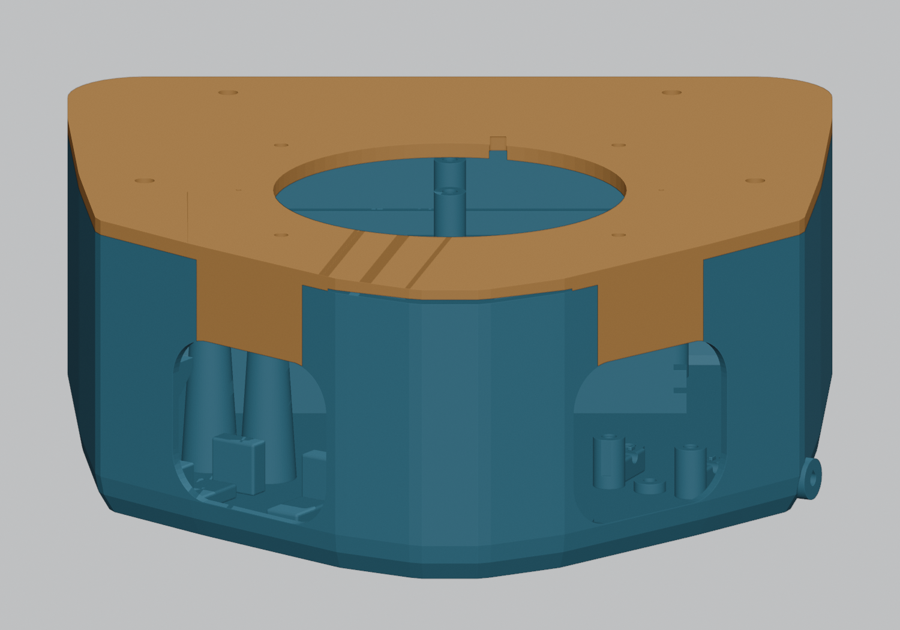
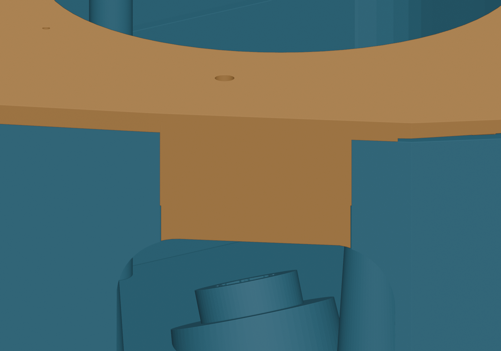
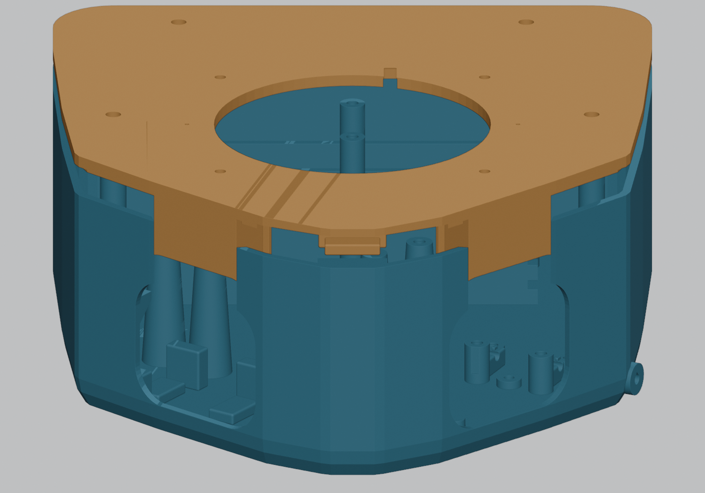
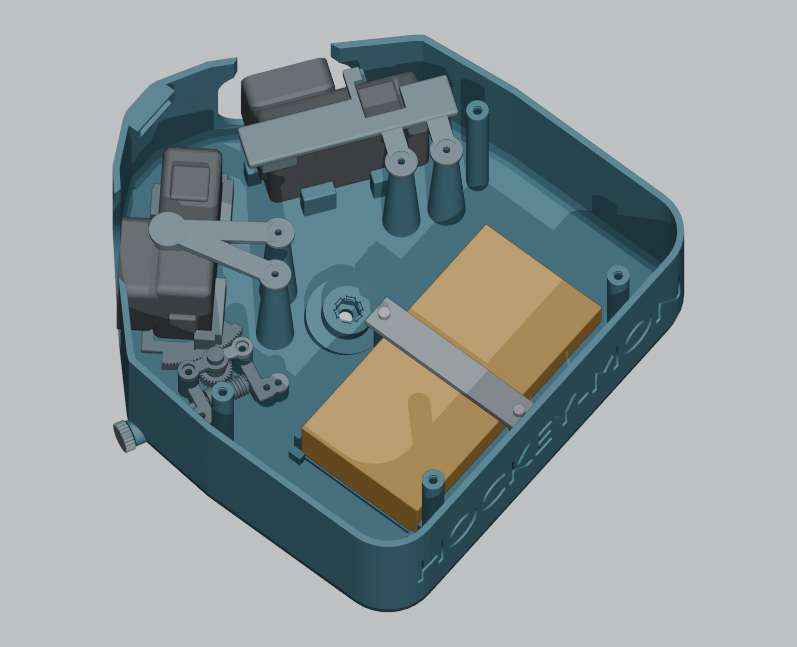
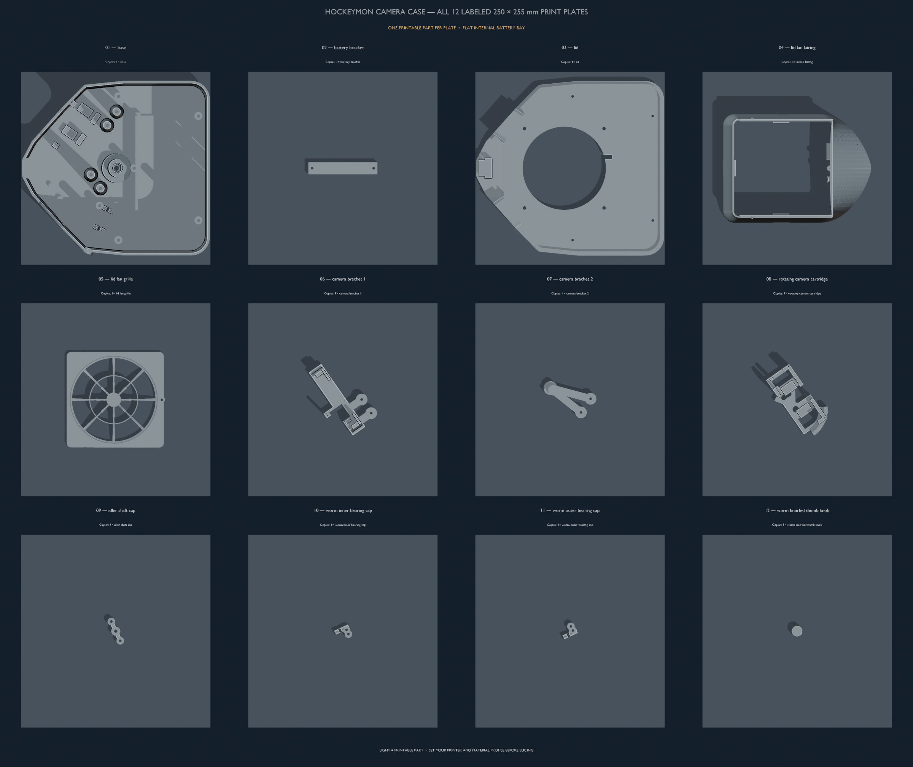

# HockeyMON camera case

Build from the repository root:

```sh
make -C models3d hockeymon-camera-case
make -C models3d hockeymon-camera-case-plate-overview
make -C models3d dim-pdf
make -C models3d check-dim-pdf-sync
make -C models3d check-hockeymon-battery-slot
make -C models3d check-hockeymon-fan-cover
make -C models3d check-hockeymon-eye-closures
make -C models3d check-print-3mf
```

## Printable 3MF

`make -C models3d hockeymon-camera-case` now also generates
`models3d/hockeymon-camera-case/hockeymom_cam_case.3mf` alongside the STLs.
It contains all **12 default printable parts**, each labeled on its own
**250 × 255 mm plate** in the same orientation as its STL, resting on Z=0.
Purchased hardware, battery mockups and assembly references are excluded.
Optional printable parts follow the active configuration; stale STLs are
never collected from the output directory.

Open the project in Bambu Studio or OrcaSlicer to retain separate plates.
Choose your printer and material profile before slicing; the project does
not assign either. Its generic 0.4 mm nozzle and 250 mm height entries are
import placeholders; replace them with your actual machine profile. Readers that only support standard 3MF meshes may require
arranging the parts onto separate plates. Use supports under the fan fairing's
tail. The near-bed-width base and lid need no outward brim or skirt.
For custom Blender runs, set `EXPORT_3MF = False` for STL-only output.
The Make target always generates both formats.

## Flush lid eye fillers







The descending lid fillers restore the upper eye openings **flush with the
actual outside case contour**. Their visible faces follow the same outline
as the lid edge. The camera mounting plane stays recessed; the wider keyed
backing remains inside. Each filler keeps **0.25 mm side clearance** and
**0.20 mm aperture clearance** around the eye opening.

The base's slot cheeks have **45-degree internal lead-ins**, extending
**5 mm inward**, with a **0.25 mm front land**. These clear the fillers as
the lid tilts into its front anchor while preserving the visible slot edges.
**Print the matching base and lid from this revision**; the new flush lid
can bind against the previous base during insertion. The current compact
base and lid remain within the 250 × 255 mm individual-part print limit.

## Streamlined fan cover and rear corners


The fan fairing now sweeps **52 mm aft** into a low, rounded tip above the
battery bay. Its broad shoulders blend into the existing fan grille, which
still slides forward after removing its top locking screw. The fan mounting
positions and two hidden fairing screws stay in place. The hollow tail uses
a surface-normal wall offset so its shallow roof retains the selected wall
thickness. Print the fairing open side down with removable supports beneath
the tail; the separate grille still prints flat without supports.

Rear case corners use a **24 mm radius**, with the outer envelope margin
controlled separately so rounding does not grow the case beyond the printer
limit. The 40 mm USB space, rear screw access and battery fit are checked
against the rounded shell. Use the matching base and lid for this revision.

## Compact flat battery bay



The gold battery envelope and gray retaining bar are shown with the lid and fan removed.

The 26.3 × 70 × 138 mm battery lies flat inside the case: 70 mm front to back
(X), 138 mm across (Y), and 26.3 mm high (Z). Its Y range is −69 to +69 mm,
centered on the bottom bolt axis. The USB-A/USB-C face points toward +Y and
has 40 mm of internal plug and cable-bend space, from Y=+69 to +109 mm. The
outer shell mirrors that space on the other side to remain symmetric. The
cameras, adjustment mechanism, bolt access, and removable lid still fit.

The default base is **248.58 × 231.18 × 77 mm**; the matching main lid
brings body height to **81.653 mm**, before the fan assembly. The previous
upright-battery base was about 249.25 × 237.99 × 90 mm. Thus the flat layout
saves about 0.67 mm front to back, 6.81 mm across, and 13 mm in base height.
The camera hardware and rear lid posts limit further depth reduction. Each
part is exported to its own 250 × 255 mm 3MF plate, with its matching STL.
The base and lid from the flat-battery revision must be printed together.



The battery sits at Z=5.7–32 mm. About **17.8 mm of its 70 mm depth** lies
beneath the fan opening in plan, below the air passage. The retaining bar,
screw heads, and battery leave more than 30 mm of vertical space below the
fan-side lid opening. The model checks an open upper fan column and battery
assembly clearances. A conservative side-view path from the fan's rear edge
to the nearest camera rear face clears the battery screws by about 9.8 mm;
this is a geometric estimate, not a measured airflow rate. Keep loose USB cable
loops away from the fan.

A low two-wall cradle has 0.6 mm side fit, with small 4 mm-high corner stops
at both Y ends to limit sliding. The 91.2 × 16 × 4 mm screw-on bar crosses
the middle of the battery. Use two M3 × 10 mm socket-head screws and, for a
rigid base, two M3 × 5 mm heat-set inserts in the cradle posts. TPU mode uses
pointed M3 pilots. Remove the lid and fan, remove the bar, unplug the battery,
then lift it past the stops. Check the purchased pack and plugs physically
before field use.

The generator validates outer symmetry, pack/USB and cable clearance,
retention, mount and lid-post keepouts, cooling space, and each printable
part's bed fit. The battery regression covers rigid and TPU bodies and both
single and paired lid fans. The dimension guide shows the flat layout.
