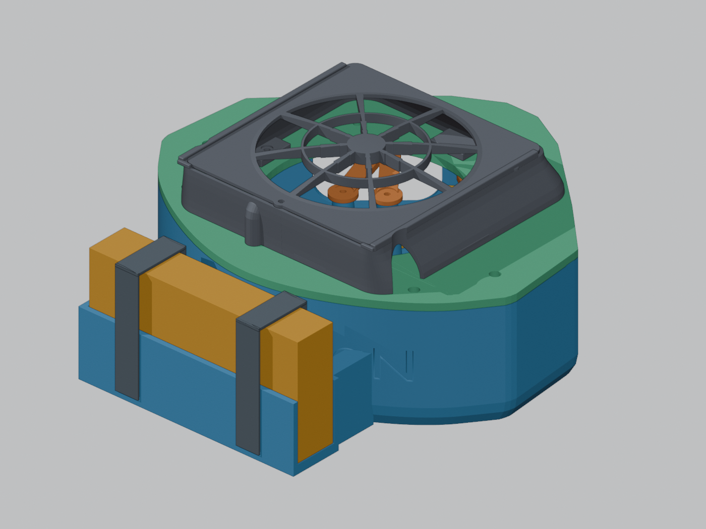
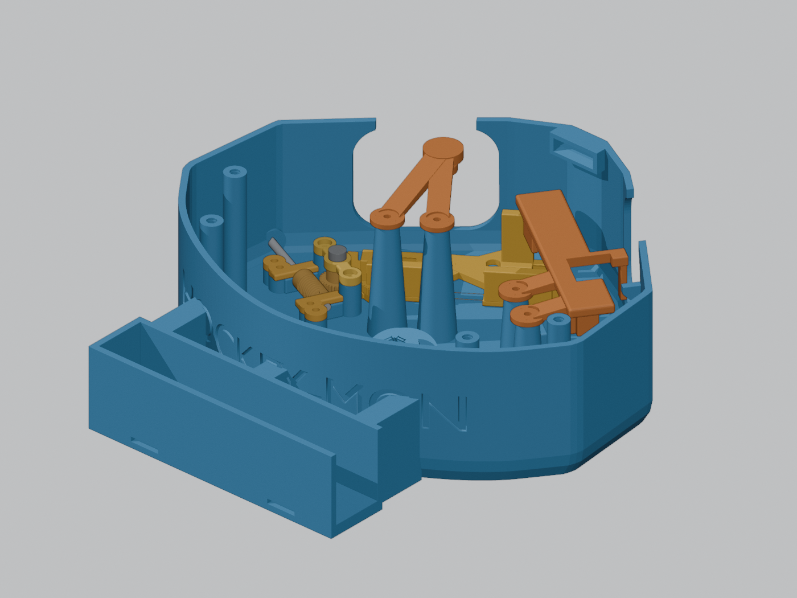

# HockeyMON camera case

Build the print parts from the repository root:

```sh
make -C models3d hockeymon-camera-case
make -C models3d dim-pdf
make -C models3d check-dim-pdf-sync
make -C models3d check-hockeymon-battery-slot
```

## Rear battery slot





The orange block and straps illustrate the purchased parts; connector
positions are not modeled.

The base includes an external slot for a **26.3 × 70 × 138 mm** battery.
Its 138 mm length runs across the back (Y), its 70 mm height is vertical (Z),
and its 26.3 mm thickness projects rearward (X). Orient the USB-A/USB-C end
toward **+Y**. The entire 26.3 × 70 mm connector face is open, with **40 mm**
reserved beyond it for straight USB plugs and cable bends. This allowance is
configurable; measure unusually long plugs before printing.

The slot has 0.6 mm clearance on each X side and at the closed end, giving
27.5 mm clear width and 139.2 mm length to the open end. The battery rests
5.7 mm above the build plate, so its installed top is at Z=75.7 mm. The walls
are 42 mm high and 3.2 mm thick. No cover needs to be removed to load it.

Use **two 15 mm hook-and-loop straps**, approximately 250 mm long, to retain
the pack. Thread them through the 16 × 2.5 mm tunnels below the battery,
up the outside of both slot walls and over the pack; tighten both straps.
The straps provide retention at the open end and top. Unplug the battery and
release both straps before lifting it out. Straps are purchased separately.

The holder starts 8 mm behind the complete assembled case/lid/fan envelope.
Three external roots join it to the existing rear wall. The battery, holder
and USB plug space stay outside the camera cooling chamber, preserving the
top-fan path for both intake and exhaust. Route the power cables externally
to the existing bottom keystone USB connections, keeping them off the fan
grille and camera openings. Main shell dimensions, camera placement, lid,
and bottom mounts retain their existing geometry; the base gains a rear
projection. The holder partly covers the existing recessed rear label.

Print the base upright, with its existing bottom on the build plate. The
holder and roots grow from the plate; the short strap tunnel roofs are small
bridges. Check battery fit and strap security before field use.

The `REAR_BATTERY_*` settings in `hockeymom_cam_case_blender.py` control fit,
plug clearance, gap, walls and straps. The slot supports the lid-fan modes;
set `REAR_BATTERY_SLOT_ENABLED = False` before choosing rear-wall fans. The
generator rejects that incompatible combination to avoid blocking airflow.

The dimension PDF includes a battery assembly drawing and all battery
configuration dimensions. Geometry validation checks the battery envelope,
continuous top-loading path, full-face USB clearance and manifold base.
