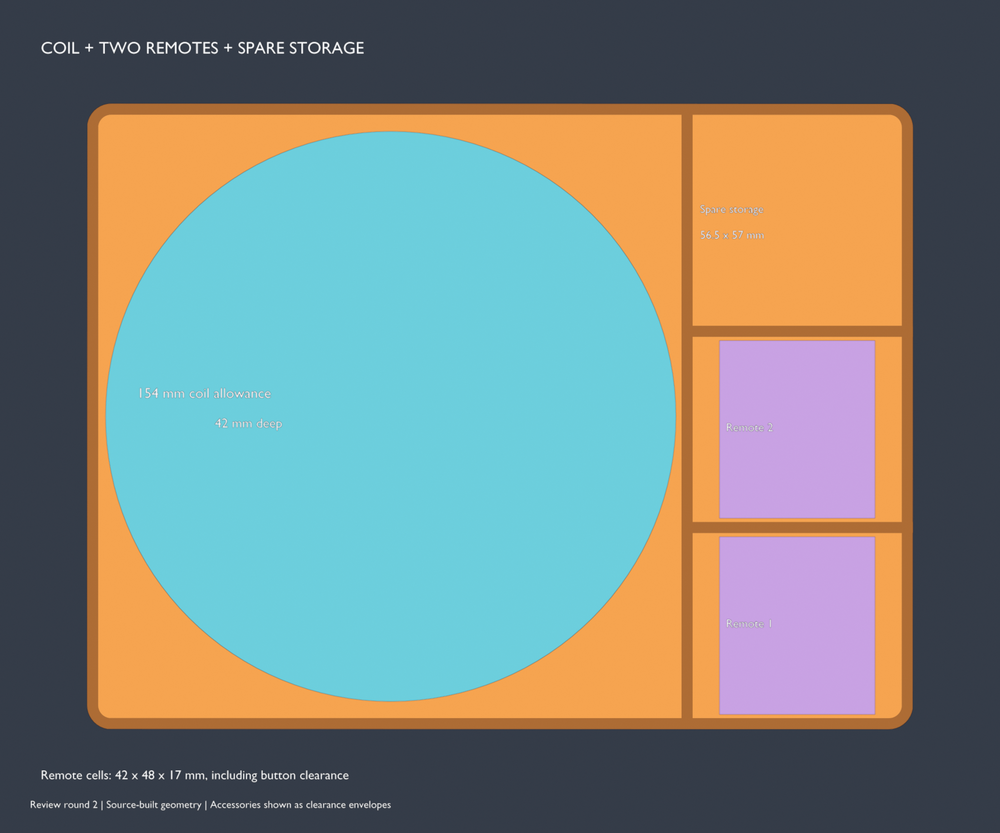

# Expanded Mission 1 alternate case

The expanded case carries the existing two complete fan-case camera assemblies,
small fan cables, batteries and battery doors, plus the assembled goalpost mount,
two remotes, and a large rolled cord. It replaces the compact case and inserts.
The stronger latch, handle hardware, and 3.8 mm hinge-rod fit remain in use.

Both lids carry **Sports AI** in the same embedded Neuropol font style, with
the orange inlay and hockey artwork.


The default generator produces this kit:

```sh
make -C models3d mission1-field-case
make -C models3d mission1-field-case-plate-overview
```

The project contains **15 unique STLs on 10 plates**, including rigid and 68D TPU
lid alternatives. Select one lid. The compact dual-fan inserts are a separate
profile, available with `make -C models3d mission1-field-case-compact`; they are
not part of this expanded packing arrangement. Their separate exports go into
`mission1-field-case/compact/`, retaining the previous case dimensions and kit.

## Dimensions and print fit

| Dimension | Expanded case |
| --- | ---: |
| Main shell width × depth × bottom-to-rim height | 234 × 180 × 160 mm |
| Internal width × depth × floor-to-rim height | 225 × 171 × 156.8 mm |
| Base printed envelope, including projections | approximately 241.6 × 209.8 × 165 mm |
| Lid printed envelope | approximately 244 × 207.8 × 16 mm |
| Closed case height, bottom to lid top | 171 mm |

Every printed part fits within 250 × 250 mm and below 250 mm tall. The 3MF turns
both shell and compound lid plates by 90° in plan so they also clear the
printer's 18 × 28 mm excluded corner. Keep this placement when slicing. The
standalone shell/lid STLs may need the same rotation on a printer with that
corner exclusion. Check any brim or skirt against the remaining bed margin.

Case depth and height were increased with explicit authorization for this
loadout. Camera and fan locations, outward fan angles, cable routes, and the
positions of the batteries and PWM plugs are preserved. The door slots keep
their horizontal positions; their floors now sit at 13.8 mm above the insert
underside, raising each door by 10.8 mm. Their 24.8 mm front rims match the
adjacent battery-pocket rims, with 11 mm seating depth and 7 mm of door exposed
for removal. This change requires reprinting only the lower TPU insert; the
case bottom, camera seats, battery pockets, trays and lids are unchanged.


The lower insert extends to the new shell walls and retains the bearing webs
for the tray stack.
The PWM insertion corridors are cut after the final guide/web unions so those
unions cannot close the plug channels.

## What fits

| Item | Supplied measurement | Reserved envelope |
| --- | --- | --- |
| Assembled mount | Photo suggests approximately 205 × 140 mm; maximum depth 35 mm | 210 × 146 × 37 mm |
| Rolled cord | Approximately Ø150 × 40 mm | Ø154 × 42 mm |
| Each of two remotes | 37.5 × 14.5 × 45.5 mm, plus 1.5 mm side buttons | 42 × 48 × 17 mm, lying flat |

The mount dimensions are estimates from the photographed ruler, not a precision
scan. It fits assembled as shown within the reserved envelope; tuck the tether
inside that envelope. The cord allowance accepts modest winding variation; a
looser bundle larger than Ø154 × 42 mm needs recoiling.

The remote buttons project from a 14.5 × 45.5 mm face, so they increase the
37.5 mm body axis to 39 mm. The 42 mm pocket envelope adds 3 mm beyond this total.
Its reference dimensions derive from the body and button parameters. Keep the
button sides clear; the dividers do not depend on pressing a button for retention.



## Packing and retained storage

Pack from the bottom upward:

1. Seat the lower TPU insert and the existing complete camera/fan assemblies,
   small cables, batteries, doors, and PWM plugs.
2. Fit the lower front utility bin. It retains approximately **217 × 37.5 ×
   24.7 mm** of usable storage beneath the mount tray.
3. Fit the rigid mount tray and lay the assembled mount flat inside it. The
   tray rests on the rear cradle ledges and the front utility bin's side walls.
4. Fit the rigid upper organizer. Put the rolled cord in the large left bay,
   and place the two remotes flat in the right-hand cells. The remaining
   **56.5 × 57 mm** cell provides spare storage, with 18 mm divider height and
   approximately 43 mm overall headroom. Rounded corners slightly reduce its
   rectangular volume.
5. Fit the 2 mm 85A TPU lid pad and close the lid. Keep the normal gasket.

To unpack, open the lid to 110°, lift out the loaded organizer, then the mount
tray, then the front bin. The trays are stacked; the front bin cannot lift out
through the mount tray. Fit four 2 mm cord pull loops through the mount tray’s
3.5 mm vertical eye holes, with stopper knots below the eyes. The eyes project
inward at the front and rear so the cords never run in the 1 mm gap between
tray and shell. Lift the front and rear together to keep the loaded tray level.
Tuck the loops entirely below the mount-tray rim, in the front and rear gaps
around the mount, before installing the organizer. Finger scallops provide
access after lifting a tray clear of the case. Both accessory trays have flat
3 mm floors and 3 mm outer walls.

| Height above outside case bottom | Nominal height |
| --- | ---: |
| Highest seated camera/fan feature | 75.27 mm |
| Mount tray underside / front-bin rim | 75.97 mm |
| Mount tray inner floor | 78.97 mm |
| Top of conservative mount envelope | 115.97 mm |
| Upper organizer underside | 118.00 mm |
| Upper organizer inner floor | 121.00 mm |
| Top of conservative cord envelope | 163.00 mm |
| Upper organizer rim | 164.30 mm |
| Lid pad underside | 165.00 mm |
| Rigid lid inner face | 167.00 mm |

The lid pad has **0.7 mm clearance above the organizer rim**, with no intended
tray compression. The previous key clearance correction is carried into the
upper organizer. Its rear-rim notch follows the locating key to X = −42 mm,
Y = +82 mm; the notch is 14 × 8 mm and 3 mm deep. A 0.6 mm stack allowance still
leaves 0.1 mm pad clearance. This is a geometric allowance, not a prediction of
any particular printer's dimensional error.


## Printing and hardware

Use rigid PETG or another tough rigid filament for the shell, chosen rigid lid,
**mount tray** (`mission1_field_case_mount_tray.stl`), and **upper organizer**
(`mission1_field_case_accessory_organizer.stl`). The 3MF assigns both accessory
trays to rigid filament 1; their broad floors should be solid. Use 0.20 mm layers,
at least four walls, and enough top/bottom layers to make the 3 mm floors solid.

Use a suitable resilient TPU for the lower insert and front utility bin. The
replacement flat lid pad uses **85A TPU**; select the actual filament profile for
its separate plate. The optional snap lid and calibration coupon require the
specified 68D material, not the 85A pad filament. The project uses a generic TPU
preset, which does not itself encode Shore hardness.

The enlarged base, lid, gasket, pad and insert set require new prints. The
separate latch parts, handle, 151 mm-long 3.8 mm hinge rod, and hinge coupon retain
their prior dimensions. Use the existing M3 latch and M3 × 14 handle hardware.
The hinge openings remain 4.325 mm in the base, 4.55 mm at the lid receiver and
4.4 mm at the rigid slot. The optional snap throat is now 3.5 mm, giving 0.3 mm diametral interference
with the 3.8 mm rod (previously 0.2 mm). Its straight section is 1.55 mm long,
leaving approximately 0.096 mm of flat throat beyond the round receiver before
the smooth 0.8 mm lead-in. The four coupon banks use this same updated entrance;
one dot is the nominal 3.5 mm, followed by 3.6/3.7/3.8 mm.

The latch-bearing lip is now **3.2 mm thick on the rigid lid** and **4.0 mm on
the 68D TPU lid**, increased from 2.4 mm. Added material sits below the existing
bearing surface and continues into its back-wall reinforcement. Latch take-up,
rail position, case dimensions and storage clearances are unchanged. These are
lid-only refinements; existing base, latch, handle and inserts remain compatible.
The hinge change tightens nominal snap interference; retention force depends
on the printed material. The optional lid still uses 68D TPU; the separate
2 mm lid pad remains 85A TPU.


## Checks


Generation validates the actual lower camera/fan/cable/hardware loadout, tray
bearings, cavity containment, accessory dimensions, button clearance, loaded
tray removal, both lid variants' closing paths, latch/handle mechanics, mesh
integrity and the complete 3MF. Reference envelopes are excluded from exports.

```sh
blender --background --factory-startup --threads 8 --python-exit-code 1 \
  --python models3d/mission1-field-case/check_mission1_expanded_storage.py
blender --background --factory-startup --threads 8 --python-exit-code 1 \
  --python models3d/mission1-field-case/check_mission1_alternate_closure.py
```

The accessory regression rejects a mount placed outside its assigned cavity,
an oversized button envelope, and a blocked cable bay. The closure regression
rejects the unnotched top tray, overly thick lid pads and a reversed pad notch.
Cached-scene runs may use `-- --scene /path/to/validated-field-case.blend`.

The focused lid regression checks both lip thicknesses, latch motion and hinge
closure, then rejects a lip cut back to 2.4 mm and a TPU opening widened to
3.6 mm:

```sh
blender --background --factory-startup --threads 8 --python-exit-code 1 \
  --python models3d/mission1-field-case/check_mission1_lid_lip_hinge.py
```
