# Expanded Mission 1 alternate case

The expanded case carries the existing two complete fan-case camera assemblies,
small fan cables, batteries and battery doors, plus the assembled goalpost mount,
three custom remotes, two OEM backup remotes, and a large rolled cord. It replaces the compact case and inserts.
The stronger latch, handle hardware, and 3.8 mm hinge-rod fit remain in use.

The shell exterior follows the supplied `build_hardcase.py`: **25 mm plan-view
corners**, a rounded bottom blending over 30 mm with a 14 mm inset, narrower
**6 × 6 mm impact ribs**, and a matching 5 mm bumper on the front and sides of
the parting rim. The rear bumper is relieved for the existing hinge sweep, and
three full-width buttresses rise from 20 mm above the floor into the base hinge
barrels, following the reference hardcase's long rear load paths.
Both lids have a **24 mm raised, curved shoulder** above the original latch
and hinge line. Their 6 mm-wide guards ramp into the shoulder and end at the
parting rim; local pockets in the base guards clear the reinforced latch lips.

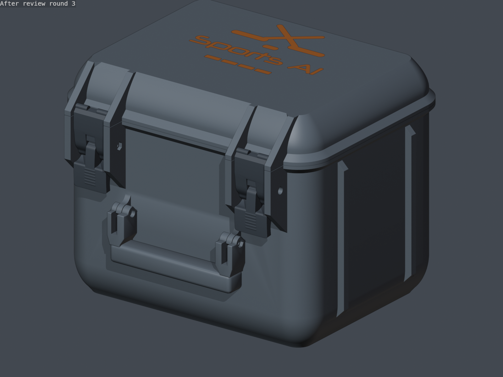

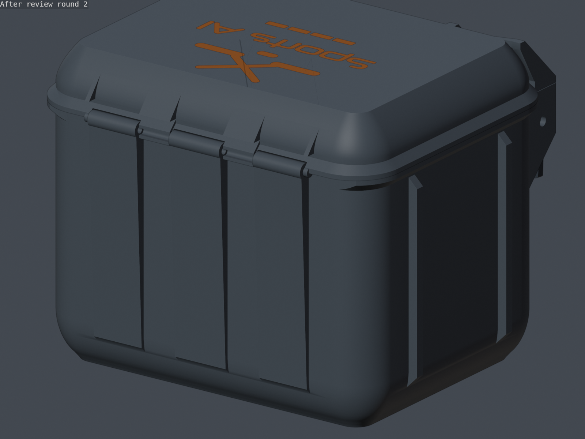

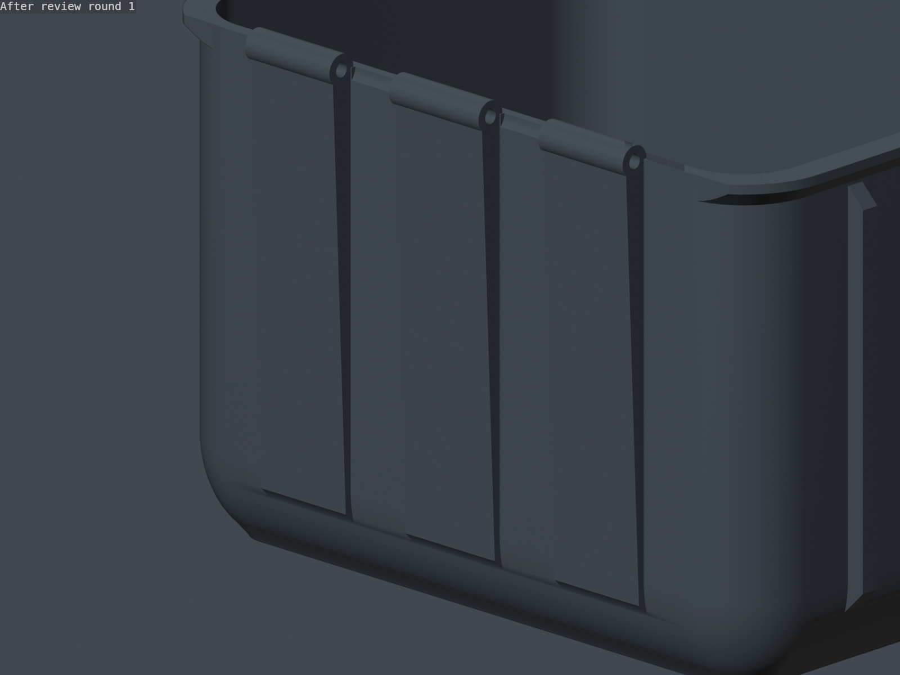

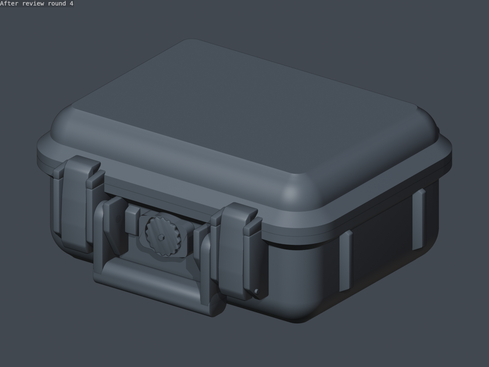

The reference's shape is adapted to the existing 250 mm print bed and equipment
stack. It retains the Sports AI inlay, two-piece latches, M3 latch/handle screws
and existing 3.8 mm hinge rod. The reference uses interleaved knuckles and axial
pins; this revision retains the calibrated removable rigid and TPU-for-AMS
hinge options.

```sh
make -C models3d mission1-field-case
make -C models3d mission1-field-case-plate-overview
```

The project contains **16 unique STLs on 11 plates**, including rigid PETG and
TPU-for-AMS lid alternatives. Select one lid. The compact dual-fan kit remains separately
available with `make -C models3d mission1-field-case-compact`; its exports go in
`mission1-field-case/compact/`. It retains its original corner radius and lid
height, with the narrower ribs, rim guards and supported tray rails.

## Dimensions and print fit

| Dimension | Expanded case |
| --- | ---: |
| Main shell width × depth × bottom-to-rim height | 234 × 180 × 160 mm |
| Nominal internal width × depth × floor-to-rim height | 225 × 171 × 156.8 mm |
| Base printed envelope, including projections | 246 × 209.8 × 165 mm |
| Rigid lid printed envelope | 244 × 207.8 × 39.8 mm |
| TPU lid printed envelope | 244 × 209.44 × 39.64 mm |
| Closed case height, bottom to lid top | 195 mm |
| Equipment contact face in closed lid | Z = 165 mm |

The nominal cavity dimensions are preserved; the rounded floor and corners
reduce space locally. The lower insert uses an inward 45° ramp inside that curved floor, and the
mount tray, front bin and remote organizer have matching rounded corners.
Camera, battery, door, cable, mount, cord and remote positions are retained.
The raised roof pad is one closed, form-fitting TPU body that follows the
rounded lid interior. Its lower contact face remains at the existing packing
plane, while the 2% gyroid slicer setting leaves the volume mostly hollow inside
its two wall loops. Bond its broad roof face inside the lid with a suitable
TPU-compatible adhesive. The asymmetrical key determines its orientation.

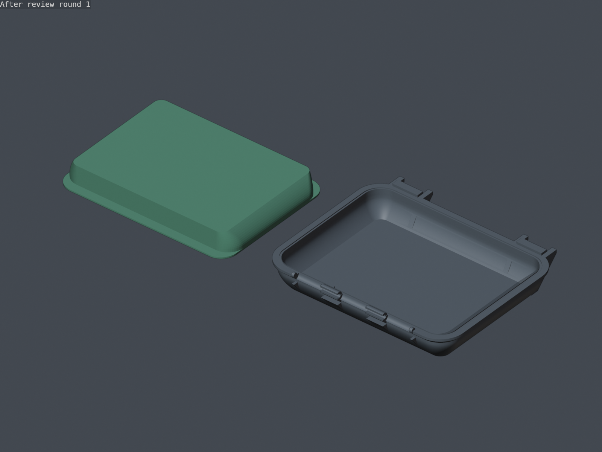

**The rounded-case, latch, and fan-angle updates preserve the case and tray
outer envelopes.** The fan-angle update described below changes the lower
insert and adds local upward-open clearance passages with inward return walls
at the front bin's rear rim; the mount
tray, organizer, form-fitting roof pad, handle, gasket, inlay, and hinge hardware remain usable. Upgrading
from the previous 40.96 mm / M3 × 50 latch station requires the matching base,
chosen lid, levers, and hooks described in [Wider latches and handle](#wider-latches-and-handle).
No other packing component or case envelope changes.

Every part fits within 250 × 250 mm and below 250 mm tall. The project turns the
base and compound lids 90° in plan to clear the printer's excluded corner.
Keep this placement and check any brim against the remaining bed margin.
Print the base upright, the lid crown-down and the pad contact-face-down with
its shaped body upward. Exterior ramps stay within 45°; the latch bays and hinge
receivers retain short bridges. The project uses 0.20 mm layers and keeps
supports globally disabled. Per-object support is enabled only for both lid
alternatives, the lid-latch coupon, and the latch levers and hooks. The lids and
coupon use a 30-degree support threshold. Each outer latch protector now has a
tapered 4 mm roof return that joins its narrow crown-down footprint to the broad
lid crown, matching the stable root treatment of the inner protectors without
changing the lid envelope.
Bridge quality and physical fit still require a printed check with your
material.

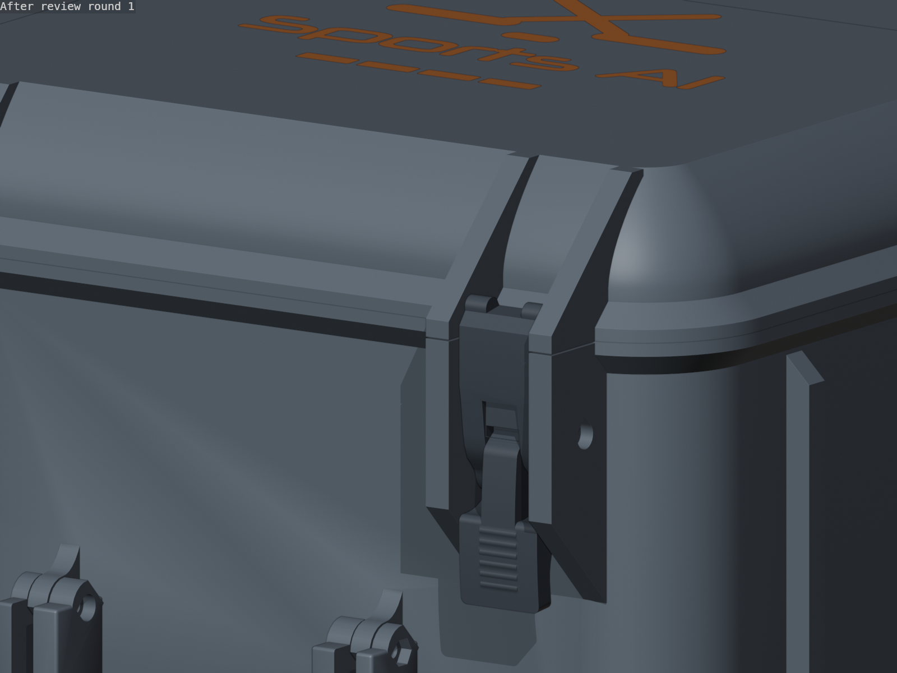

Before reprinting a complete TPU lid, print
`mission1_field_case_tpu_lid_latch_station_coupon.stl`. This **59.56 × 55 ×
38.8 mm** exact crop of the production TPU lid contains one complete left
latch station: its inner and outer protector, rounded crown-to-corner shoulder,
the outer protector's tapered crown return, deep molded bay, load ledge, capture
rail, and side webs. It prints crown-down in Bambu TPU for AMS with **6 wall
loops, 45% grid infill**, and the same **30-degree support threshold** as the
complete lid. The
new 30.96 mm latch hook seats on the coupon's production rail and ledge, so the
small print checks protector surface quality and latch fit before committing to
the full lid. A coupon printed for the former 40.96 mm station has the same
outer envelope but different rail, protector, and side-web geometry; print the
regenerated coupon when qualifying this lid revision.

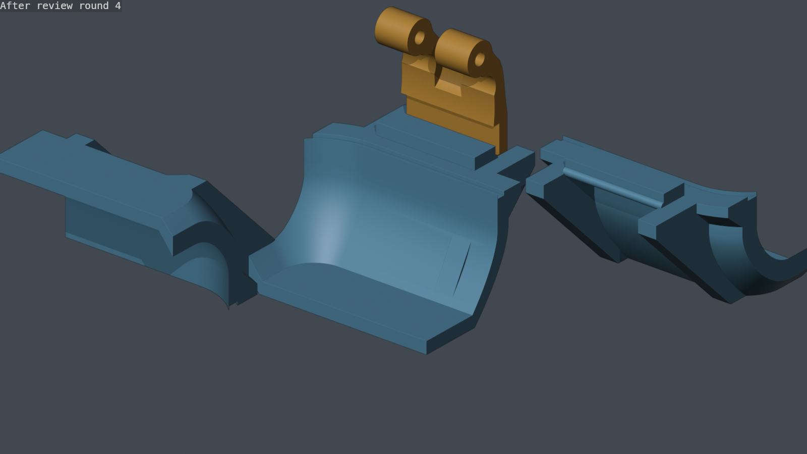

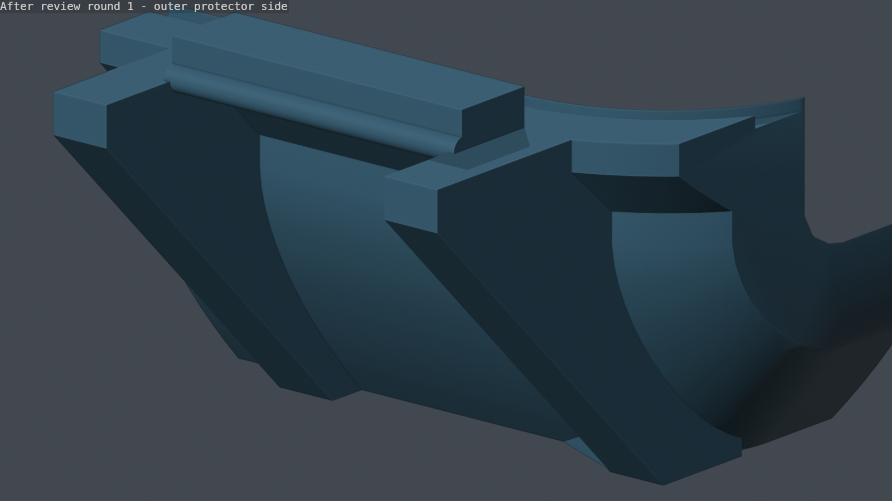

The lower insert uses the battery-door pockets raised level with the inserted
battery tops, swept ±15-to-±30-degree fan clearances, deeper rear fan-inlet
reliefs, cable corridors and load-bearing webs inside the reshaped liner. The
front utility bin keeps its existing outer dimensions and receives two local
upward-open rear-rim passages that preserve at least 0.7 mm clearance through
the complete angle range. A 2 mm inward return wall around each passage keeps
the storage bay enclosed; reprint that bin with the lower insert when using the
full fan-angle range.

## What fits

| Item | Supplied measurement | Reserved envelope |
| --- | --- | --- |
| Assembled mount | Photo suggests approximately 205 × 140 mm; maximum depth 35 mm | 210 × 146 × 37 mm |
| Rolled cord | Approximately Ø150 × 40 mm | Ø154 × 42 mm |
| Three custom remotes | 37.5 × 45.5 × 14.5 mm body, plus 1.5 mm side buttons | Upright: 14.5 × 45.5 × 39 mm, button edge up |
| Two OEM GoPro remotes | 66 × 40 × 19 mm | Upright: 19 × 66 × 40 mm, assuming measurements include buttons |

The mount dimensions are estimates from the photographed ruler, not a precision
scan. It fits assembled as shown within the reserved envelope; tuck the tether
inside that envelope. The cord allowance accepts modest winding variation; a
looser bundle larger than Ø154 × 42 mm needs recoiling.

The entire organizer is now **one piece of TPU 95A**, including five integral
remote slots. Its outer envelope remains **223 × 169 × 46.3 mm**, with the
3 mm main floor, rear key notch and stack bearings. Local air passages
under the front/rear edges leave at least 2 mm of floor above their roofs. The right-hand strip
contains a continuous molded pocket block, bonded to the floor, cord divider
and outside wall. Reprint this organizer for the remote slots and channels,
and the mount tray for its matching air channels. The remote slot geometry is
retained in the organizer with rounded outer corners. The full Ø154 × 42 mm cord bay
remains available.

### Remote slots and button clearance

Each pocket is **26 mm deep**, with **0.30 mm clearance per side** around the
body and two small squeeze nubs on the plain short ends. Each nub projects
**0.20 mm into the nominal body envelope** over an 8 × 3 mm patch. These local
nubs provide soft friction; the surrounding deep walls provide side support,
as with the battery pockets in the lower fan-case insert. All five pockets
have continuous guides along both sides. The outside finger scallops stop at
the pocket rims so they do not remove the support below them.

The three custom remotes stand with their 37.5 mm body axis vertical and their
1.5 mm side-button projection pointing upward, entirely above the pocket rims.
The two OEM controls stand with the 40 mm axis vertical and the 66 mm axis
along the tray. **All screen/front faces point toward +X, the right-hand
outside wall, away from the cord bay.** Load and remove each remote vertically.
Recessed `FACE >` and `BUTTON EDGE UP` legends mark the orientation.

Each OEM pocket has an upward-open **3 mm front-button clearance zone over the
central 54 mm** of its 66 mm length. The remaining **6 mm band at each short
end of the front face** acts as a full-depth casing guide, providing support
against sideways tipping without filling the central button area.

**The OEM button layout has not yet been measured.** This design assumes the
66 × 40 × 19 mm measurement includes the buttons, that side buttons face
upward, and that the bottom, short-end grip patches and 6 mm front-edge casing
bands are plain. Confirm those areas on the physical controls; button relief
must be extended or moved if necessary. The renderings show measured envelopes,
not detailed button CAD. Retention force and TPU deflection need a printed fit
check. The modeled pocket clearance is not a prediction of printed tolerance.

Checks reserve **2 mm above and around the upward button edge**, plus the OEM
front clearance described above. Seated and continuous vertical button sweeps
must clear the tray, shell and other accessories. With the existing 0.6 mm
stack allowance, actual closed-pad headroom is **4.4 mm above the custom button
envelopes and 3.4 mm above the OEM envelopes** (5 and 4 mm nominally).

The validation also requires 22 mm of uninterrupted side-guide material at
four casing corners per pocket. The body clears these guides when upright,
but contacts them when tilted **±2° about either horizontal axis**, excluding
the floor and grip nubs from that calculation. This checks geometric restraint;
soft-material stiffness and transport loads still require physical testing.
Only the ten designated nub contacts may overlap the remote bodies.


### Air channels for lifting the tray

Both the **TPU organizer** and the **TPU 95A goalpost mount tray** have four
**5 mm-wide × 1 mm-deep outside grooves**: two on the front wall and two on the
rear wall, at X = ±80 mm. They let air reach beneath each tray as it is lifted,
including while it is fully seated on the supporting parts. Their positions
avoid the remote pockets, pull-cord eyes, grip notches, locating key and
established stack-bearing locations.

Each groove feeds two underside passages extending 5 mm inward across that
rim. Each passage is **2 mm wide × 1 mm high**, with a **45° pitched roof**.
The pair leaves a 1 mm central bearing rib. At least **2 mm of wall and floor**
remains around the channels. The storage compartments stay closed at the
bottom. The organizer remains **223 × 169 × 46.3 mm**; the goalpost tray remains
**223 × 169 × 42.03 mm**, with its original **217 × 163 mm** inner footprint and
the same **210 × 146 × 37 mm** mount clearance envelope. The mount tray remains
dimensionally unchanged; both trays now use TPU 95A.

Solid air probes check **eight continuous routes per tray**, against the case
and the actual supporting parts: the mount tray beneath the organizer, and
the lower insert and utility bin beneath the mount tray. Separate material
probes check the remaining wall, floor and central ribs. Existing stack-bearing
checks still apply. These prove open geometric routes; suction reduction and
deformation of printed material remain physical tests. Cyan arrows illustrate
the air paths.


## Packing and retained storage

Pack from the bottom upward:

1. Seat the lower TPU insert and the existing complete camera/fan assemblies,
   small cables, batteries, doors, and PWM plugs.
2. Fit the lower front utility bin. It retains approximately **217 × 37.5 ×
   24.7 mm** of nominal usable storage beneath the mount tray. Its two local
   return walls displace approximately 0.5 mL from that rectangular envelope.
3. Fit the TPU 95A mount tray and lay the assembled mount flat inside it. The
   tray rests on the rear cradle ledges and the front utility bin's side walls.
4. Fit the one-piece TPU 95A upper organizer. Put the rolled cord in the large
   left bay. Load three custom remotes in the short front pockets and two OEM
   remotes in the longer rear pockets, in the orientation described above.
   Keep straps tucked clear of every button and within the available tray height.
5. Fit the keyed, form-fitting TPU 95A roof pad and close the lid. Keep the
   normal gasket.

To unpack, open the lid to 110°, lift out the loaded organizer, then the mount
tray, then the front bin. The trays are stacked; the front bin cannot lift out
through the mount tray. Fit four 2 mm cord pull loops through the mount tray’s
3.5 mm vertical eye holes, with stopper knots below the eyes. The eyes project
inward at the front and rear so the cords never run in the 1 mm gap between
tray and shell. Lift the front and rear together to keep the loaded tray level.
Tuck the loops entirely below the mount-tray rim, in the front and rear gaps
around the mount, before installing the organizer. Finger scallops provide
access after lifting a tray clear of the case. Both accessory trays have
3 mm main floors and outer walls; each tray's local air-channel relief
leaves at least 2 mm of floor and wall around each passage.

| Height above outside case bottom | Nominal height |
| --- | ---: |
| Highest seated camera/fan feature | 75.27 mm |
| Mount tray underside / front-bin rim | 75.97 mm |
| Mount tray inner floor | 78.97 mm |
| Top of conservative mount envelope | 115.97 mm |
| Upper organizer underside | 118.00 mm |
| Upper organizer inner floor | 121.00 mm |
| Remote seat on the organizer floor | 121.00 mm |
| Integral remote pocket rims | 147.00 mm |
| Top of custom button envelope | 160.00 mm |
| Top of OEM remote envelope | 161.00 mm |
| Top of conservative cord envelope | 163.00 mm |
| Upper organizer rim | 164.30 mm |
| Lid pad underside | 165.00 mm |
| Rigid lid inner face | 167.00 mm |

The lid pad has **0.7 mm clearance above the organizer rim**, with no intended
tray compression. The previous key clearance correction is carried into the
upper organizer. Its rear-rim notch follows the locating key to X = −42 mm,
Y = +82 mm; the notch is 14 × 8 mm and 3 mm deep. A 0.6 mm stack allowance still
leaves 0.1 mm pad clearance. This is a geometric allowance, not a prediction of
any particular printer's dimensional error.


## Printing and hardware

Every rigid project object is assigned to `Bambu PETG HF @BBL X1C`. The latch
lever, latch hook, and handle have object overrides for **4 wall loops and 45%
sparse infill**; supports remain enabled only for the lever and hook. Every
internal tray—the lower insert, mount tray, front utility bin,
remote organizer, and raised roof pad—is assigned to
`Bambu TPU 95A HF @BBL X1C` with **2 wall loops and 2% gyroid infill**. Load this
soft TPU from the external spool or another supported manual workflow instead
of an unsupported AMS path. The trays print floor down; their air passages
have 45° roofs and retain the required floor above them.

The entire **upper organizer**
(`mission1_field_case_accessory_organizer.stl`) prints floor down in TPU 95A.
Its upward-open slots have no roofs, the small retention nubs have rounded
edges, and the underside air passages use 45° roofs. Supports remain disabled
for this part and every other internal tray. A diagnostic
0.20 mm slice checks support-free toolpaths; it is not calibrated printer G-code.
The earlier air-channel revision required reprinting both the organizer and
mount tray. There is no
separate retainer STL or extra retainer plate; the complete project contains
16 unique STLs on 11 plates.

The optional snap lid, hinge coupon, and lid-latch coupon use
`Bambu TPU for AMS @BBL P1P`. The lid and exact-crop latch coupon use **6 wall
loops and 45% grid infill**; the hinge coupon retains **45% rectilinear
infill**. Supports are enabled for the lid-latch coupon and complete lid, and
disabled for the hinge coupon. The rigid lid alternative also has per-object
supports enabled. Both
lids and the latch coupon use a 30-degree support threshold; the outer
protectors use tapered crown-down feet and continuous returns that follow the
rounded lid shoulder through the rim. This removes the open side gap while
keeping each outward step at or below a printable 1:1 slope.
The latch lever and hook objects are the only other support-enabled parts. The
project selects the Textured PEI Plate and disables
the prime tower because the lid occupies nearly the full 250 mm bed; filament
changes still purge through the printer's normal chute workflow.

When upgrading from the earlier compact or narrow-hardware revision, the
enlarged base, lid, gasket, pad and insert set require matching prints, along
with the wide latch parts and handle described below. The 151 mm-long 3.8 mm
hinge rod retains its prior dimensions. That hinge revision also requires its
updated coupon with the optional TPU lid.
The hinge openings remain 4.325 mm in the base, 4.55 mm at the lid receiver and
4.4 mm at the rigid slot. The optional snap throat is now 2.8 mm, giving 1.00 mm diametral interference
with the 3.8 mm rod (previously 0.3 mm). Its straight section is 1.89 mm long,
leaving 0.097 mm of flat throat beyond the round receiver before the smooth
0.48 mm lead-in. Throat and lead length are derived from the throat width, so
each coupon bank reproduces that same 0.097 mm flat at its own width; one dot
is 2.7 mm, then the nominal 2.8 mm, followed by 2.9/3.0 mm.
The TPU entrance and blunt jaws point upward at 45° in print orientation so
the upper jaw grows from the receiver roof instead of starting in midair.
Open the TPU lid about **25°** for progressive attachment/removal. The rigid
lid retains its horizontal slot and **70°** removal position. Both retain
the same rod axis and existing base. Check the coupon with the actual material.

The latch-bearing lip is now **3.2 mm thick on the rigid lid** and **4.0 mm on
the TPU-for-AMS lid**, increased from 2.4 mm. Added material sits below the existing
bearing surface and continues into its back-wall reinforcement. Latch take-up,
rail position and storage contacts are retained. When upgrading from the older
shell revision, use the matching wide base, lid, latch set and handle. Snap force depends on the
printed material; the optional lid uses TPU for AMS, and the closed,
form-fitting roof pad uses TPU 95A with sparse gyroid infill.


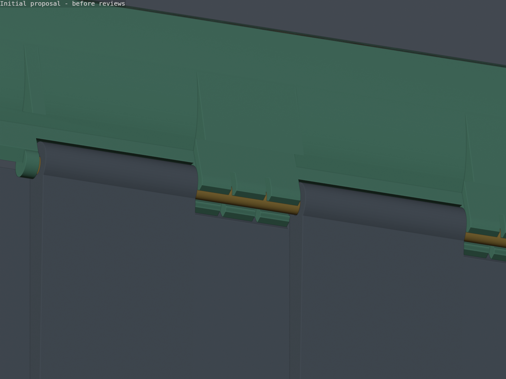

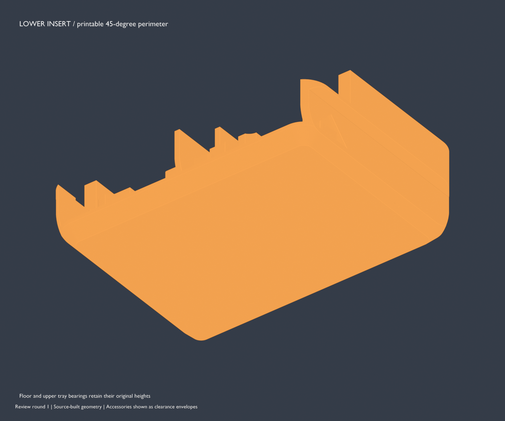

## Wider latches and handle

The expanded case has **30.96 mm-wide latches**, 10.48 mm wider than the
original 20.48 mm parts,
and a **119.8 mm overall handle envelope**, about 20.8% wider than 99.2 mm.
The handle's solid grip is 115.6 mm wide with a 95.6 mm opening. Each complete
fork moves outward 10.3 mm; its original mount shape, wall thickness, bores,
and 18-to-24 mm transition are preserved. Latch centers move from ±82 mm to
**±77 mm**, keeping each handle-side edge at its previous position while taking
the full 10 mm width reduction from the outside edge. The guards remain
18.22 mm inside the case sides.

A **hard 1 mm minimum-clearance check covers continuous 360° handle rotation**
against both closed latch levers, hooks, and moving link rods. The generated
meshes have **1.02 mm minimum axial separation**, after including ±0.2 mm latch
and ±0.4 mm handle axial play. Rotation about the handle's pivot preserves
this lateral separation at every angle. Protection walls are excluded from
this constraint; the check does not rely on a guard stopping rotation.

The full project build runs this check before export.
`check_mission1_closed_latch_handle.py` rejects the colliding 124 mm handle,
a positive gap below 1 mm, interference due to axial play, and deliberately
colliding moving parts. The original fork geometry is also compared against
the widened forks. Normal 0–90° handle travel retains **3.31 mm vertical
separation** through all latch positions, with latch release, handle strength,
and Allen access independently checked.

When upgrading from the previous 40.96 mm / M3 × 50 design, reprint the
**base, chosen lid, both latch levers, and both hooks** as a matching set. The
119.8 mm handle is unchanged and remains reusable. The narrowed mounts are
incompatible with the previous 40.96 mm latches. The case interior remains
**225 × 171 mm**, with the same
156.8 mm floor-to-rim depth, so existing inserts, gasket, inlay and hinge parts
remain usable. The compact profile retains its original hardware and dimensions.

Each wide latch needs one **M3 × 40 socket-head screw**, one M3 hex nut, and a
**4 mm-diameter rod cut to 30.96 mm**. The 4.7 mm-deep head recess leaves a
1.3 mm nominal guard floor, 3.84 mm reach beyond the nut-pocket floor, and
1.14 mm nominal screw-tip projection. It retains full 2.4 mm nut engagement
after allowing 0.5 mm for a short screw, 0.2 mm for printed stack growth, and
0.5 mm for the incomplete lead thread; worst-case usable thread is 2.64 mm and
tip projection is 1.84 mm. Reuse the handle's two **M3 × 14 screws and M3 nuts**.

The width change leaves the closure linkage unchanged. The moving pivot crosses
dead center at -8.067 degrees and closes at +3 degrees, **11.067 degrees past
dead center**, with 0.200 mm of over-center depth. The measured hook draw peaks
at 31.306063 mm and relaxes to 31.190529 mm when fully closed, a **0.115534 mm
post-peak pressure release**. The toggle therefore holds itself shut after the
peak instead of depending on the secondary snap detents alone.

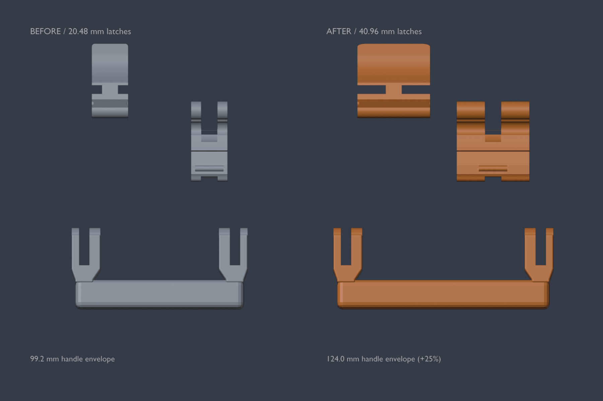

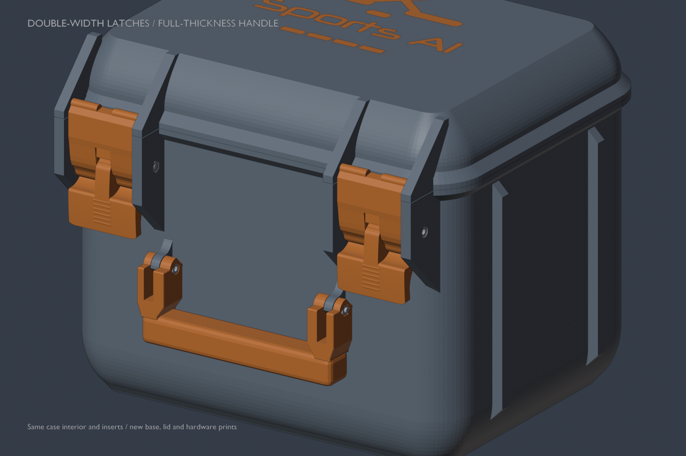

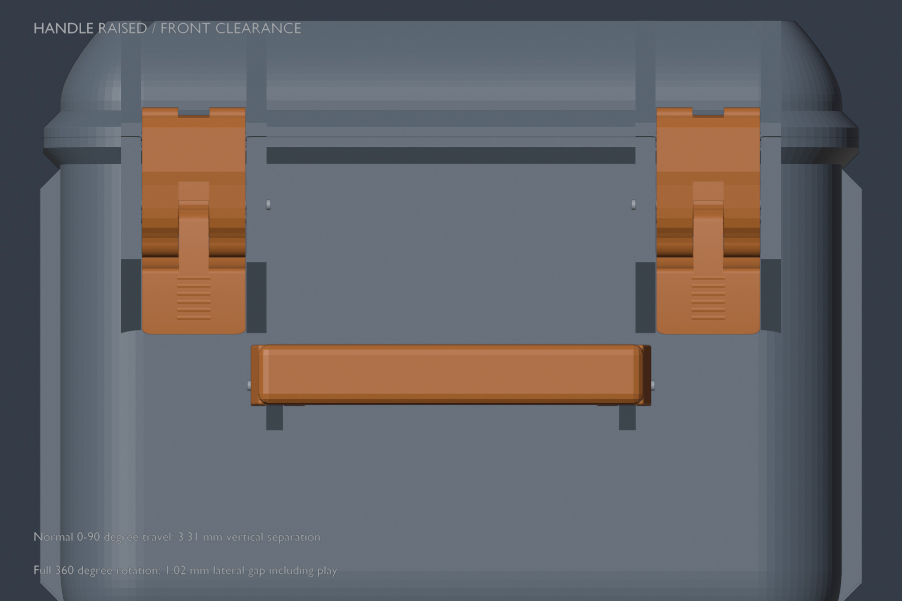

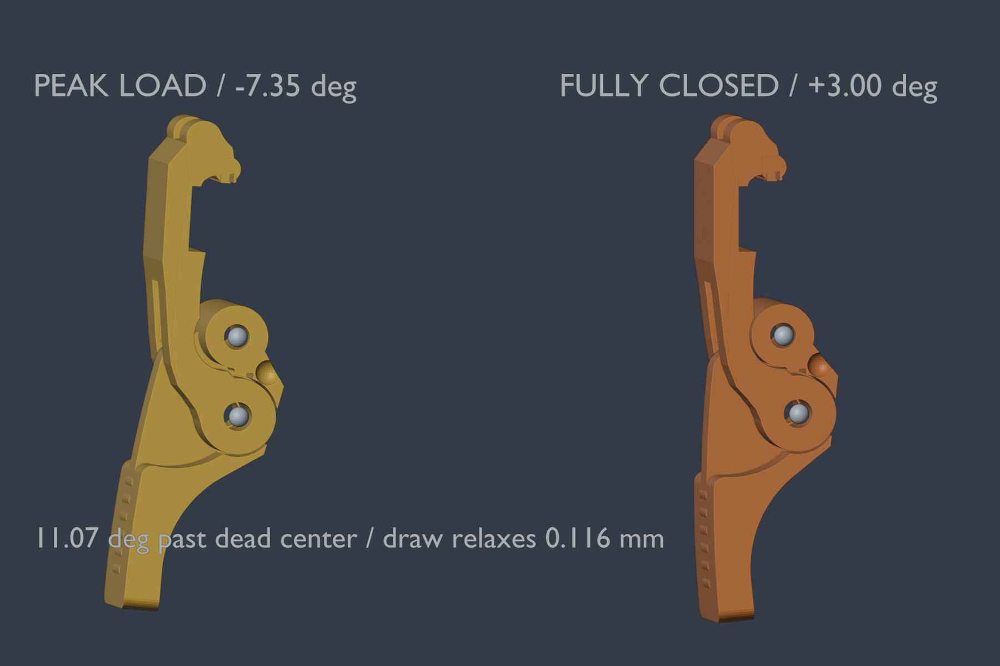

Regenerate these views with `render_mission1_wide_hardware.py` in background
Blender. Run `check_mission1_wide_hardware.py` for width, interior preservation,
compact compatibility and collision-rejection checks, together with the existing
latch and handle regression scripts.

## Checks


Generation validates the actual lower camera/fan/cable/hardware loadout, tray
bearings, continuous air passages, cavity containment, accessory dimensions, button clearance, loaded
tray removal, both lid variants' closing paths, latch/handle mechanics, mesh
integrity and the complete 3MF. Reference envelopes are excluded from exports.

```sh
blender --background --factory-startup --threads 8 --python-exit-code 1 \
  --python models3d/mission1-field-case/check_mission1_expanded_storage.py
blender --background --factory-startup --threads 8 --python-exit-code 1 \
  --python models3d/mission1-field-case/check_mission1_alternate_closure.py
```

The accessory regression rejects a mount placed outside its assigned cavity,
an oversized button envelope, and a blocked cable bay. The dedicated slot check
rejects a missing nub, absent or shallow side walls, missing end guides that
allow tipping, a rib in the button air, unintended body contact, tray growth,
a missing spare envelope, a shifted remote, zero squeeze, and insufficient
button headroom below the lid pad:

```sh
blender --background --factory-startup --threads 8 --python-exit-code 1 \
  --python models3d/mission1-field-case/check_mission1_remote_slots.py
```

The air-channel regression rejects a blocked outside groove, a filled underside
passage, insufficient floor or wall material, and a missing central bearing rib
on either tray. It also rejects a utility-bin obstruction beneath the mount
tray. Supply a validated scene to reuse the unchanged lower insert; the case
and both vented trays are rebuilt from current source:

```sh
blender --background --factory-startup --threads 8 --python-exit-code 1 \
  --python models3d/mission1-field-case/check_mission1_air_channels.py \
  -- --scene /path/to/validated-field-case.blend
```

Render each tray's channels from five angles using `render_mission1_air_channels.py`
with `-- --scene /path/to/validated-field-case.blend`.

These are geometry checks against the stated body/button assumptions, not a
substitute for confirming the physical OEM button positions and printed fit.
The closure regression rejects the unnotched top tray, overly thick lid pads and a reversed pad notch.
Cached-scene runs may use `-- --scene /path/to/validated-field-case.blend`.

The focused lid regression checks both lip thicknesses, latch motion and hinge
closure, then rejects a lip cut back to 2.4 mm and a TPU opening widened to
3.6 mm:

```sh
blender --background --factory-startup --threads 8 --python-exit-code 1 \
  --python models3d/mission1-field-case/check_mission1_lid_lip_hinge.py
```

## Rebuilding and checking the rounded exterior

```sh
make -C models3d mission1-field-case
make -C models3d check-mission1-hardcase-exterior
make -C models3d mission1-field-case-plate-overview
make -C models3d mission1-field-case-dim-pdf
make -C models3d check-mission1-field-case-dim-pdf-sync
```

The normal build checks both lid closures and hinge sweeps, latch and handle
clearances, the complete packed loadout and removable trays, manifold meshes,
and the generated 3MF. The focused exterior check also rejects an unsupported
lid shelf, a pad that cannot reach the roof, and a hollow region modeled into
the pad instead of being left to sparse slicer infill. The new shell views come
from `render_mission1_hardcase_exterior.py`; pass `-- --review-round N` to label
an updated review set. The before view is the source at `a9d8807`, and the
reference view builds the supplied `build_hardcase.py` directly.
